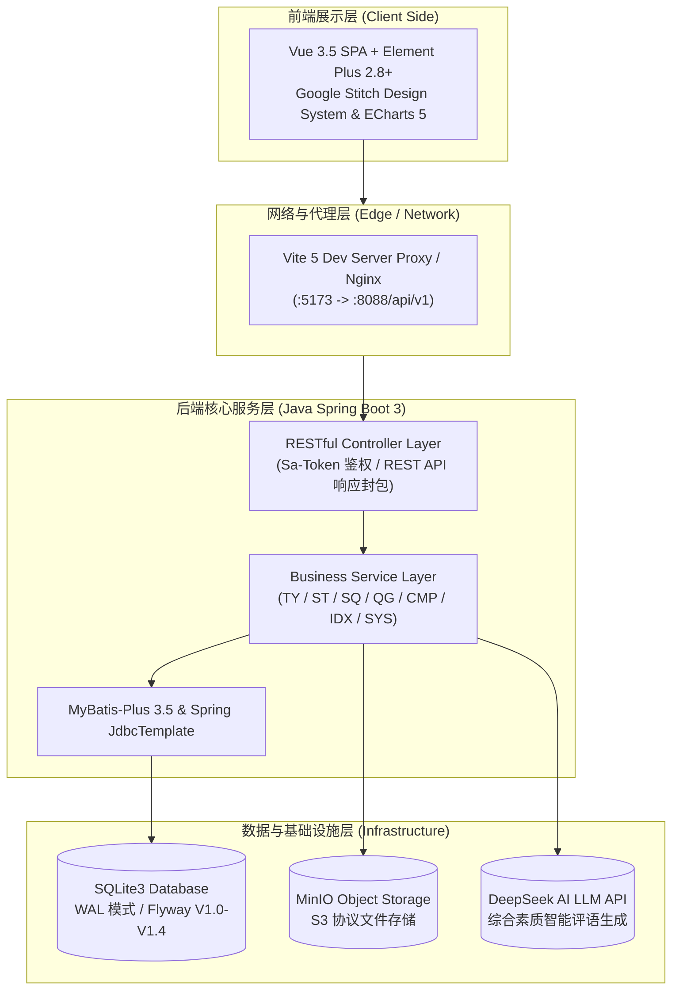

# StudentHub · 学生“一站式”自主管理过程管理系统

<p naming="badges">
  
  
  
  
  
  
  
  
  
  
</p>

> **StudentHub** 是一个面向高校“第二课堂”与学生事务管理的现代化统一管理平台。系统围绕 **“学生主体 + 过程档案 + 时间戳”** 沉淀全生命周期过程数据，全面覆盖 **团员发展 (TY)、社团活动 (ST)、学生社区 (SQ)、勤工助学 (QG)** 四大业务模块，结合 **DeepSeek 大语言模型 (LLM)** 形成可量化的综合素质评价体系，实现校园事务数字化与智能化闭环。

---

## 🌟 项目核心亮点与创新特色

1. 🎨 **Google Stitch Nexus Campus 顶尖极简 UI**
   - 遵循 Google Stitch Tokens 与 Design System 视觉规范，采用深蓝色与柔和渐变调色盘、玻璃拟态（Glassmorphism）、微动画以及自适应弹性布局，提供媲美顶尖 SaaS 系统的交互体验。

2. ⚡ **SQLite3 高性能 WAL 架构 + Flyway 自动化迁移**
   - 底层数据库采用 SQLite3 WAL（Write-Ahead Logging）写前日志模式，配置并发锁超时与外键约束；集成 Flyway（`V1.0` ~ `V1.4`）实现数据库 Migration 自动化管理与 **全模块 25+ 条高质感真实种子数据落盘**。

3. 🤖 **DeepSeek AI 大模型综合素质智能诊断**
   - 接入 DeepSeek LLM 大语言模型 API，基于学生在团员发展、社团活动、社区履职、勤工打卡及学业考评五维量化数据，秒级生成专业评语与成才发展建议，支持辅导员人工覆写与持久化。

4. 🔒 **Sa-Token + RBAC 级联权限卡控与无感刷新**
   - 采用 Sa-Token 轻量级鉴权框架，结合客户端 JWT 机制与路由守卫（Router Guard），严格隔离系统管理员（`R-SY-ADMIN`）、院系辅导员（`R-IDX-COUNSELOR`）与普通学生角色权限；支持 HTTP 401 透明无感刷新与 403 优雅重定向。

5. 🛠️ **全链路模块化与 100% 单元测试全绿覆盖**
   - 采用单体模块化架构（Modular Monolith），后端 Controller / Service / Mapper 分层清晰。内置完整的 JUnit 5 集成测试套件（`StudentHubCrudTest`），验证 7 大模块 CRUD 接口 100% 通过。

---

## 🏗️ 架构设计

### 1. 系统总体架构图



---

## 🛠️ 技术栈清单

| 分层 | 技术 / 框架 | 版本 | 核心说明 |
| :--- | :--- | :--- | :--- |
| **后端核心** | Java / JDK | 21 | 现代 Java 21  LTS 运行时环境 |
| **后端框架** | Spring Boot | 3.3.14 | 核心应用驱动与依赖注入 |
| **持久层** | MyBatis-Plus | 3.5.7 | ORM 映射与灵活的 SQL 条件构造器 |
| **数据库** | SQLite3 | 3.x | WAL 写前日志模式、高并发锁超时、强外键约束 |
| **数据库迁移** | Flyway | 10.x | 自动化 Schema 与 DML 迁移（V1.0 ~ V1.4） |
| **安全鉴权** | Sa-Token | 1.37+ | JWT 模式、RBAC/ABAC 角色控制与透明刷新 |
| **前端框架** | Vue.js | 3.5.x | Composition API (`<script setup>`) 范式 |
| **构建工具** | Vite | 5.x | 极速热重载与 Webpack 代码分割构建 |
| **UI 组件库** | Element Plus | 2.8+ | 按需自动引入与 Element 图标系统 |
| **视觉设计** | Google Stitch | 2.1 | 自定义 CSS Tokens 与 Nexus Campus 质感规范 |
| **图表可视化** | ECharts | 5.x | 动态雷达图、趋势折线图（支持自动 Resize 与销毁回收） |
| **对象存储** | MinIO SDK | 8.5.x | S3 协议分片上传与预签名临时预览 URL |
| **人工智能** | DeepSeek LLM | API | 五维综合素质智能评语与发展建议生成 |

---

## 🗺️ 9 大顶级导航与 35 个子功能全景

```text
StudentHub 导航全景图
├── 📊 1. 工作台 (Dashboard) ➔ 管理驾驶舱 / 全校 KPI / ECharts 五维图 / DeepSeek AI 智能评语
├── 🚩 2. 团员发展 (TY) ➔ 入团申请 / 审批中心 / 推优大会 / 培养记录 / 发展对象 / 政审管理 / 发展大会 / 转正流程 / 团员花名册
├── 🎪 3. 社团活动 (ST) ➔ 社团管理 / 招新计划 / 招新广场 / 活动管理与分级审批 / 活动签到打卡 / 活动总结
├── 🏢 4. 学生社区 (SQ) ➔ 楼栋宿舍网格图 / 宿舍巡查打卡 / 异常事件上报与处置闭环
├── 🛠️ 5. 勤工助学 (QG) ➔ 困难认定库 / 岗位管理 / 工时打卡 / 岗位申请 / 考勤统计
├── 👤 6. 我的事务 (Mine) ➔ 我的团员发展 / 我的申请 / 思想汇报 / 我的社团 / 我的勤工 / 我的综合分 / 个人档案
├── 🎓 7. 学生管理 (IDX) ➔ 学生学籍列表与档案 / 班级级联树 / 学生批量导入（面向管理员及导员）
├── ⚙️ 8. 系统管理 (SYS) ➔ 字典管理 / 用户账号与角色分配 / 组织架构管理 / 任务监控
└── 🔔 9. 消息中心 (NOTI) ➔ 系统通知列表与消息已读标记
```

---

## 📁 项目工程目录结构

```
StudentManagementSystemVD/
├── start.bat                   # ★ 一键并行启动脚本 (Spring Boot:8088 + Vite:5173)
├── StudentHub_Project_Presentation.pptx # 9 页标准答辩演示文稿
├── AUDIT_FIX_PLAN.md           # P0 代码审查与安全加固记录
├── backend/                    # Java 后端 (Maven 工程)
│   ├── pom.xml                 # Maven 依赖构建描述
│   ├── data/                   # SQLite 数据库持久化目录 (studenthub.db)
│   └── src/
│       ├── main/
│       │   ├── java/com/studenthub/
│       │   │   ├── StudentHubApplication.java # Spring Boot 引导类
│       │   │   ├── common/     # 统一 R 响应封包
│       │   │   ├── config/     # Spring 统一配置 (CorsConfig, FlywayConfig, WebMvcConfig)
│       │   │   └── modules/    # ★ 业务控制器与持久层 (按模块拆分)
│       │   │       ├── auth/   # Sa-Token 鉴权与登录
│       │   │       ├── idx/    # 学生身份与组织树
│       │   │       ├── ty/     # 团员发展全流程 (推优/培养/政审/发展大会/转正/花名册)
│       │   │       ├── st/     # 社团活动与招新广场
│       │   │       ├── sq/     # 社区宿舍网格与巡查事件
│       │   │       ├── qg/     # 勤工助学岗位与工时打卡
│       │   │       ├── cmp/    # 综合素质量化与 DeepSeek AI
│       │   │       └── sys/    # 系统字典与账号角色
│       │   └── resources/
│       │       ├── application.yml # 环境配置文件
│       │       └── db/migration/   # Flyway SQL 自动化迁移文件 (V1.0 ~ V1.4)
│       └── test/java/com/studenthub/
│           └── StudentHubCrudTest.java # 7 大模块 CRUD API 集成单元测试
├── frontend/                   # Vue 3 前端工程
│   ├── src/
│   │   ├── api/                # 按模块封装的 Axios API (http.js 统一拦截)
│   │   ├── components/         # 基础与通用组件
│   │   ├── layouts/            # DefaultLayout.vue (含 Keep-Alive 页面缓存)
│   │   ├── router/             # 路由配置 (含权限守卫与全量 Meta)
│   │   ├── stores/             # Pinia Store (auth.js, menu.js, dict.js)
│   │   └── views/              # 35 个业务视图页面 (按模块子目录组织)
│   ├── vite.config.js          # Vite 代理与打包配置
│   └── package.json
└── docs/                       # 项目架构与规范 SSOT 文档 (PRD / ADR / DB / SRD / Iteration)
```

---

## 🚀 快速开始

### 1. 环境准备
确保本地安装有以下环境：
- **JDK**: Java 21+
- **Maven**: 3.9+
- **Node.js**: v18.x 或 v20.x

### 2. 一键启动项目（推荐）
在项目根目录下，直接双击运行或在 CMD/PowerShell 中执行 `start.bat`：
```cmd
.\start.bat
```
脚本将并行开启两个终端窗口：
- **后端服务**：`http://127.0.0.1:8088/api/v1`
- **前端 Web 界面**：`http://127.0.0.1:5173`

---

### 3. 分体手动启动

#### 启动后端 (Java Spring Boot)
```bash
cd backend
mvn spring-boot:run
```
*后端将在端口 `8088` 启动，Flyway 会自动检查数据库并按序执行 `V1.0` ~ `V1.4` 脚本完成建表与灌入 25+ 真实样本数据。*

#### 启动前端 (Vue 3 + Vite)
```bash
cd frontend
npm install
npm run dev
```

---

## 🧪 自动化测试与构建校验

### 1. 执行后端集成单元测试
```bash
cd backend
mvn test
```
*预期结果：`StudentHubCrudTest` 运行全 Green 0 Failures（验证用户增删改查及 7 大模块 API 联调正常）。*

### 2. 执行前端生产打包构建
```bash
cd frontend
npm run build
```
*预期结果：打包成功，`dist/` 目录下产出极小化的打包静态资源。*

---

## 📄 架构与规范文档清单 (SSOT)

所有核心设计规范均位于 `docs/` 目录：

| 文档名称 | 路径 | 说明 |
| :--- | :--- | :--- |
| **PRD 产品需求文档** | [`docs/01_PRD.md`](file:///d:/Developing/WorkSpace/StudentManagementSystemVD/docs/01_PRD.md) | 包含 17 个核心用户故事、状态机跃迁矩阵与硬卡控规则 |
| **ADR 架构决策文档** | [`docs/02_ADR.md`](file:///d:/Developing/WorkSpace/StudentManagementSystemVD/docs/02_ADR.md) | 包含 20 项架构决策（SpringBoot3 / SQLite WAL / Sa-Token / Google Stitch） |
| **数据库设计规范** | [`docs/03_database_design_spec.md`](file:///d:/Developing/WorkSpace/StudentManagementSystemVD/docs/03_database_design_spec.md) | 包含 Mermaid ER 图、完整 DDL 表结构与索引规范 |
| **API 规范文档 (SRD)** | [`docs/04_SRD_api_specifications.md`](file:///d:/Developing/WorkSpace/StudentManagementSystemVD/docs/04_SRD_api_specifications.md) | RESTful API 契约、统一 Response 封包与错误码定义 |
| **迭代路线图** | [`docs/05_superpowers_iteration_plan.md`](file:///d:/Developing/WorkSpace/StudentManagementSystemVD/docs/05_superpowers_iteration_plan.md) | S01 ~ S12 垂直切片迭代路线图 |
| **AI 助手协作指南** | [`AGENTS.md`](file:///d:/Developing/WorkSpace/StudentManagementSystemVD/AGENTS.md) | 给 AI 编码助手的工程规范与速查入口 |

---

## 👥 成员分工

| 姓名 | 角色 | 负责内容说明 |
| :--- | :--- | :--- |
| **陈宇晗** | 组长 / PM / 架构师 / 前后端负责人 | 负责项目整体立项、产品需求拆解、全栈架构设计、数据库表结构设计、Flyway Migration 编写、Spring Boot 35+ API 接口实现、前端 Google Stitch 极简 UI 重构、DeepSeek AI 大模型接入。 |
| **童子涵** | QA & DevOps 工程师 | 负责自动化测试套件编写（`StudentHubCrudTest`）、系统压力测试与联调自检、打包脚本编写、`start.bat` 一键启动调优、工程可观测性与部署文档。 |

---

## 📜 开源协议

本项目采用 [MIT License](LICENSE) 协议开源。
