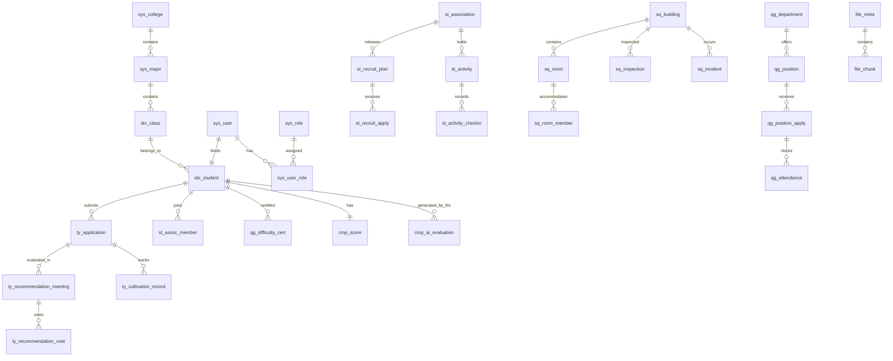

# 学生“一站式”自主管理过程管理系统 (StudentHub) · 数据库设计规范

| 文档版本 | 修订日期 | 编写者 | 数据库引擎 | 文档状态 |
| :--- | :--- | :--- | :--- | :--- |
| V2.1 (答辩强化版) | 2026-07-22 | 资深数据库架构师 | SQLite 3.45+ (WAL 模式) | 正式规约 |

---

## 0. 阅读指引与通用规范

### 0.1 命名与设计原则
1. **表命名**：采用 `模块前缀_实体名` 蛇形小写格式（如 `ty_application`, `st_activity`, `sq_inspection`, `qg_payroll`, `file_meta`）。
2. **主键规范**：所有表统一使用 `id INTEGER PRIMARY KEY AUTOINCREMENT`，SQLite 优化整数主键效率。
3. **业务编号**：业务对象统一分配 `biz_no TEXT UNIQUE` 字段，格式为 `<MODULE>-<YYYY>-<4位流水>`（例：`TY-2026-0001`）。
4. **基础通用字段**：每张业务表必须包含以下通用列：
   * `created_at DATETIME NOT NULL DEFAULT CURRENT_TIMESTAMP`
   * `updated_at DATETIME NOT NULL DEFAULT CURRENT_TIMESTAMP`
   * `created_by INTEGER`
   * `updated_by INTEGER`
   * `is_deleted INTEGER NOT NULL DEFAULT 0`
5. **软删除规范**：业务查询必须追加 `is_deleted = 0` 过滤条件，软删除的唯一索引使用 `WHERE is_deleted = 0` 部分索引。

---

## 1. 实体关系图 (ERD Overview)



---

## 2. 基础层数据表 DDL (Foundation & Auth)

### 2.1 系统用户表 (`sys_user`)
```sql
CREATE TABLE sys_user (
    id INTEGER PRIMARY KEY AUTOINCREMENT,
    username TEXT NOT NULL UNIQUE,             -- 登录名（学号/工号）
    password TEXT NOT NULL,                    -- BCrypt 密文
    real_name TEXT NOT NULL,                   -- 真实姓名
    user_type TEXT NOT NULL DEFAULT 'student' CHECK (user_type IN ('student', 'teacher', 'admin')),
    status INTEGER NOT NULL DEFAULT 1 CHECK (status IN (0, 1)), -- 1-启用, 0-禁用
    last_login_at DATETIME,
    created_at DATETIME NOT NULL DEFAULT CURRENT_TIMESTAMP,
    updated_at DATETIME NOT NULL DEFAULT CURRENT_TIMESTAMP,
    created_by INTEGER,
    updated_by INTEGER,
    is_deleted INTEGER NOT NULL DEFAULT 0
);
CREATE INDEX idx_sys_user_username ON sys_user(username);
```

### 2.2 学生主档案表 (`idx_student`)
```sql
CREATE TABLE idx_student (
    id INTEGER PRIMARY KEY AUTOINCREMENT,
    student_no TEXT NOT NULL UNIQUE,           -- 学号
    name TEXT NOT NULL,
    user_id INTEGER REFERENCES sys_user(id) ON DELETE SET NULL,
    id_card_enc TEXT,                           -- AES-256 加密身份证
    id_card_hash TEXT,                          -- SHA-256 哈希
    gender TEXT CHECK (gender IN ('M', 'F', 'U')),
    birth_date DATE,
    political_status TEXT NOT NULL DEFAULT '群众',
    college_id INTEGER,
    major_id INTEGER,
    class_id INTEGER,
    phone_enc TEXT,
    phone_hash TEXT,
    status TEXT NOT NULL DEFAULT 'enrolled' CHECK (status IN ('enrolled', 'suspended', 'graduated', 'withdrawn')),
    created_at DATETIME NOT NULL DEFAULT CURRENT_TIMESTAMP,
    updated_at DATETIME NOT NULL DEFAULT CURRENT_TIMESTAMP,
    created_by INTEGER,
    updated_by INTEGER,
    is_deleted INTEGER NOT NULL DEFAULT 0
);
```

---

## 3. MinIO 文件服务表 DDL (Module: FILE)

### 3.1 文件元数据表 (`file_meta`)
```sql
CREATE TABLE file_meta (
    id INTEGER PRIMARY KEY AUTOINCREMENT,
    file_key TEXT NOT NULL UNIQUE,              -- MinIO 对象 Key (例: 2026/07/abc.pdf)
    original_name TEXT NOT NULL,               -- 原始文件名
    bucket_name TEXT NOT NULL DEFAULT 'studenthub-bucket',
    file_size INTEGER NOT NULL,                 -- 文件字节大小
    content_type TEXT NOT NULL,                 -- MIME 类型
    uploaded_by INTEGER REFERENCES sys_user(id) ON DELETE SET NULL,
    created_at DATETIME NOT NULL DEFAULT CURRENT_TIMESTAMP,
    is_deleted INTEGER NOT NULL DEFAULT 0
);
CREATE INDEX idx_file_meta_key ON file_meta(file_key);
```

### 3.2 分片上传记录表 (`file_chunk`)
```sql
CREATE TABLE file_chunk (
    id INTEGER PRIMARY KEY AUTOINCREMENT,
    upload_id TEXT NOT NULL,                    -- MinIO Upload ID
    file_key TEXT NOT NULL,
    chunk_number INTEGER NOT NULL,             -- 分片序号 (1..N)
    chunk_size INTEGER NOT NULL,
    etag TEXT NOT NULL,                         -- MinIO 返回的 ETag
    created_at DATETIME NOT NULL DEFAULT CURRENT_TIMESTAMP
);
CREATE UNIQUE INDEX uniq_file_chunk ON file_chunk(upload_id, chunk_number);
```

---

## 4. 团员发展模块 DDL (Module: TY)

### 4.1 入团申请表 (`ty_application`)
```sql
CREATE TABLE ty_application (
    id INTEGER PRIMARY KEY AUTOINCREMENT,
    biz_no TEXT UNIQUE,                         -- 编号 TY-2026-0001
    student_id INTEGER NOT NULL REFERENCES idx_student(id) ON DELETE RESTRICT,
    apply_date DATE NOT NULL,
    statement TEXT NOT NULL,                    -- 政治思想自述（>=500字）
    app_status TEXT NOT NULL DEFAULT 'S0' CHECK (app_status IN ('S0', 'S1', 'S2', 'S3', 'S4')),
    counselor_opinion TEXT,
    college_opinion TEXT,
    league_opinion TEXT,
    created_at DATETIME NOT NULL DEFAULT CURRENT_TIMESTAMP,
    updated_at DATETIME NOT NULL DEFAULT CURRENT_TIMESTAMP,
    created_by INTEGER,
    updated_by INTEGER,
    is_deleted INTEGER NOT NULL DEFAULT 0
);
```

---

## 5. 勤工助学模块 DDL (Module: QG)

### 5.1 考勤打卡表 (`qg_attendance`)
```sql
CREATE TABLE qg_attendance (
    id INTEGER PRIMARY KEY AUTOINCREMENT,
    apply_id INTEGER NOT NULL REFERENCES qg_position_apply(id) ON DELETE CASCADE,
    clock_in DATETIME NOT NULL,
    clock_out DATETIME,
    valid_hours REAL DEFAULT 0.0,              -- 有效工时
    is_supplement INTEGER DEFAULT 0,           -- 0-正常打卡, 1-双签补卡
    created_at DATETIME NOT NULL DEFAULT CURRENT_TIMESTAMP
);
```

---

## 6. 综合量化与 LLM AI 测评表 DDL (Module: CMP & AI)

### 6.1 综合素质得分表 (`cmp_score`)
```sql
CREATE TABLE cmp_score (
    id INTEGER PRIMARY KEY AUTOINCREMENT,
    student_id INTEGER NOT NULL UNIQUE REFERENCES idx_student(id) ON DELETE CASCADE,
    total_score REAL NOT NULL DEFAULT 0.0,
    ty_score REAL NOT NULL DEFAULT 0.0,         -- 团员发展得分 (30%)
    st_score REAL NOT NULL DEFAULT 0.0,         -- 社团活动得分 (25%)
    sq_score REAL NOT NULL DEFAULT 0.0,         -- 社区自治得分 (20%)
    qg_score REAL NOT NULL DEFAULT 0.0,         -- 勤工助学得分 (15%)
    academic_score REAL NOT NULL DEFAULT 0.0,   -- 学业成绩得分 (10%)
    updated_at DATETIME NOT NULL DEFAULT CURRENT_TIMESTAMP
);
```

### 6.2 LLM AI 综测初稿与人工覆写表 (`cmp_ai_evaluation`)
```sql
CREATE TABLE cmp_ai_evaluation (
    id INTEGER PRIMARY KEY AUTOINCREMENT,
    student_id INTEGER NOT NULL REFERENCES idx_student(id) ON DELETE CASCADE,
    academic_term TEXT NOT NULL,               -- 学期 (例: 2025-2026-2)
    ai_summary TEXT NOT NULL,                   -- LLM 生成的初稿评语
    ai_suggestions TEXT,                       -- LLM 改进建议
    human_override TEXT,                        -- 辅导员人工覆写评语
    final_score REAL,                           -- 最终调整得分
    status TEXT NOT NULL DEFAULT 'draft' CHECK (status IN ('draft', 'reviewed', 'finalized')),
    reviewed_by INTEGER REFERENCES sys_user(id) ON DELETE SET NULL,
    reviewed_at DATETIME,
    created_at DATETIME NOT NULL DEFAULT CURRENT_TIMESTAMP,
    updated_at DATETIME NOT NULL DEFAULT CURRENT_TIMESTAMP
);
CREATE UNIQUE INDEX uniq_cmp_ai_eval ON cmp_ai_evaluation(student_id, academic_term);
```

---

## 7. Flyway 自动迁移初始化脚本

文件路径：`src/main/resources/db/migration/V1.0__init_schema.sql`

```sql
-- Flyway V1.0__init_schema.sql
-- 开启 SQLite 性能与合规 PRAGMA
PRAGMA journal_mode = WAL;
PRAGMA foreign_keys = ON;
PRAGMA busy_timeout = 5000;

-- (此处包含上述全部 CREATE TABLE 与 CREATE INDEX 语句)
```
