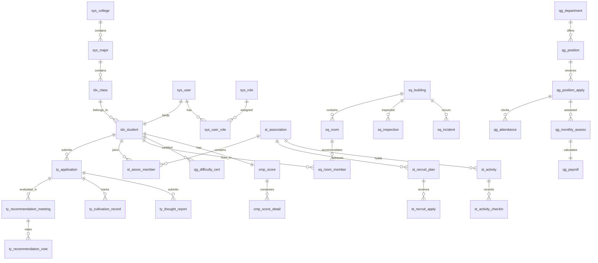

# 学生“一站式”自主管理过程管理系统 (StudentHub) · 数据库设计规范

| 文档版本 | 修订日期 | 编写者 | 数据库引擎 | 文档状态 |
| :--- | :--- | :--- | :--- | :--- |
| V2.0 (SQLite/Flyway版) | 2026-07-22 | 资深数据库架构师 | SQLite 3.45+ (WAL 模式) | 正式规约 |

---

## 0. 阅读指引与通用规范

### 0.1 命名与设计原则
1. **表命名**：采用 `模块前缀_实体名` 蛇形小写格式（如 `ty_application`, `st_activity`, `sq_inspection`, `qg_payroll`）。
2. **主键规范**：所有表统一使用 `id INTEGER PRIMARY KEY AUTOINCREMENT`，SQLite 优化整数主键效率。
3. **业务编号**：业务对象统一分配 `biz_no TEXT UNIQUE` 字段，格式为 `<MODULE>-<YYYY>-<4位流水>`（例：`TY-2026-0001`）。
4. **基础通用字段**：每张业务表必须包含以下通用列：
   * `created_at DATETIME NOT NULL DEFAULT CURRENT_TIMESTAMP`
   * `updated_at DATETIME NOT NULL DEFAULT CURRENT_TIMESTAMP`
   * `created_by INTEGER`
   * `updated_by INTEGER`
   * `is_deleted INTEGER NOT NULL DEFAULT 0`
5. **软删除规范**：业务查询必须追加 `is_deleted = 0` 过滤条件，软删除的唯一索引使用 `WHERE is_deleted = 0` 部分索引。

---

## 1. 实体关系图 (ERD Overview)



---

## 2. 基础层数据表 DDL (Foundation & Auth)

### 2.1 系统用户表 (`sys_user`)
```sql
CREATE TABLE sys_user (
    id INTEGER PRIMARY KEY AUTOINCREMENT,
    username TEXT NOT NULL UNIQUE,             -- 登录名（学号/工号）
    password TEXT NOT NULL,                    -- BCrypt 密文
    real_name TEXT NOT NULL,                   -- 真实姓名
    user_type TEXT NOT NULL DEFAULT 'student' CHECK (user_type IN ('student', 'teacher', 'admin')),
    status INTEGER NOT NULL DEFAULT 1 CHECK (status IN (0, 1)), -- 1-启用, 0-禁用
    last_login_at DATETIME,
    created_at DATETIME NOT NULL DEFAULT CURRENT_TIMESTAMP,
    updated_at DATETIME NOT NULL DEFAULT CURRENT_TIMESTAMP,
    created_by INTEGER,
    updated_by INTEGER,
    is_deleted INTEGER NOT NULL DEFAULT 0
);
CREATE INDEX idx_sys_user_username ON sys_user(username);
```

### 2.2 系统角色表 (`sys_role`)
```sql
CREATE TABLE sys_role (
    id INTEGER PRIMARY KEY AUTOINCREMENT,
    role_code TEXT NOT NULL UNIQUE,            -- 角色编码（如 R-SY-ADMIN, R-COL-COUN）
    role_name TEXT NOT NULL,
    description TEXT,
    created_at DATETIME NOT NULL DEFAULT CURRENT_TIMESTAMP,
    updated_at DATETIME NOT NULL DEFAULT CURRENT_TIMESTAMP,
    is_deleted INTEGER NOT NULL DEFAULT 0
);
```

### 2.3 用户角色关联表 (`sys_user_role`)
```sql
CREATE TABLE sys_user_role (
    id INTEGER PRIMARY KEY AUTOINCREMENT,
    user_id INTEGER NOT NULL REFERENCES sys_user(id) ON DELETE CASCADE,
    role_id INTEGER NOT NULL REFERENCES sys_role(id) ON DELETE CASCADE,
    created_at DATETIME NOT NULL DEFAULT CURRENT_TIMESTAMP
);
CREATE UNIQUE INDEX uniq_user_role ON sys_user_role(user_id, role_id);
```

### 2.4 学生主档案表 (`idx_student`)
```sql
CREATE TABLE idx_student (
    id INTEGER PRIMARY KEY AUTOINCREMENT,
    student_no TEXT NOT NULL UNIQUE,           -- 学号
    name TEXT NOT NULL,
    user_id INTEGER REFERENCES sys_user(id) ON DELETE SET NULL,
    id_card_enc TEXT,                           -- AES-256 加密身份证
    id_card_hash TEXT,                          -- SHA-256 哈希（用于检索去重）
    gender TEXT CHECK (gender IN ('M', 'F', 'U')),
    birth_date DATE,
    political_status TEXT NOT NULL DEFAULT '群众', -- 群众 / 入团积极分子 / 预备团员 / 正式团员 / 党员
    college_id INTEGER,
    major_id INTEGER,
    class_id INTEGER,
    phone_enc TEXT,                             -- AES-256 加密手机号
    phone_hash TEXT,                            -- 手机号哈希
    status TEXT NOT NULL DEFAULT 'enrolled' CHECK (status IN ('enrolled', 'suspended', 'graduated', 'withdrawn')),
    created_at DATETIME NOT NULL DEFAULT CURRENT_TIMESTAMP,
    updated_at DATETIME NOT NULL DEFAULT CURRENT_TIMESTAMP,
    created_by INTEGER,
    updated_by INTEGER,
    is_deleted INTEGER NOT NULL DEFAULT 0
);
CREATE INDEX idx_student_no ON idx_student(student_no);
CREATE INDEX idx_student_college ON idx_student(college_id);
```

---

## 3. 团员发展模块 DDL (Module: TY)

### 3.1 入团申请表 (`ty_application`)
```sql
CREATE TABLE ty_application (
    id INTEGER PRIMARY KEY AUTOINCREMENT,
    biz_no TEXT UNIQUE,                         -- 编号 TY-2026-0001
    student_id INTEGER NOT NULL REFERENCES idx_student(id) ON DELETE RESTRICT,
    apply_date DATE NOT NULL,
    statement TEXT NOT NULL,                    -- 政治思想自述（>=500字）
    app_status TEXT NOT NULL DEFAULT 'S0' CHECK (app_status IN ('S0', 'S1', 'S2', 'S3', 'S4')),
    counselor_opinion TEXT,
    college_opinion TEXT,
    league_opinion TEXT,
    created_at DATETIME NOT NULL DEFAULT CURRENT_TIMESTAMP,
    updated_at DATETIME NOT NULL DEFAULT CURRENT_TIMESTAMP,
    created_by INTEGER,
    updated_by INTEGER,
    is_deleted INTEGER NOT NULL DEFAULT 0
);
CREATE INDEX idx_ty_app_student ON ty_application(student_id);
CREATE INDEX idx_ty_app_status ON ty_application(app_status);
```

### 3.2 推优大会表 (`ty_recommendation_meeting`)
```sql
CREATE TABLE ty_recommendation_meeting (
    id INTEGER PRIMARY KEY AUTOINCREMENT,
    biz_no TEXT UNIQUE,
    branch_id INTEGER NOT NULL,                 -- 团支部 ID
    meeting_date DATETIME NOT NULL,
    location TEXT NOT NULL,
    total_members INTEGER NOT NULL,            -- 应到团员数
    attended_members INTEGER NOT NULL,         -- 实到团员数
    photo_urls TEXT,                            -- 会场照片 JSON 列表
    created_at DATETIME NOT NULL DEFAULT CURRENT_TIMESTAMP,
    updated_at DATETIME NOT NULL DEFAULT CURRENT_TIMESTAMP,
    created_by INTEGER,
    updated_by INTEGER,
    is_deleted INTEGER NOT NULL DEFAULT 0,
    CONSTRAINT chk_ty_attendance CHECK (attended_members >= (total_members * 2 / 3)) -- 刚性校验实到 >= 2/3
);
```

### 3.3 推优投票明细表 (`ty_recommendation_vote`)
```sql
CREATE TABLE ty_recommendation_vote (
    id INTEGER PRIMARY KEY AUTOINCREMENT,
    meeting_id INTEGER NOT NULL REFERENCES ty_recommendation_meeting(id) ON DELETE CASCADE,
    application_id INTEGER NOT NULL REFERENCES ty_application(id) ON DELETE CASCADE,
    approve_votes INTEGER NOT NULL DEFAULT 0,  -- 赞成票
    reject_votes INTEGER NOT NULL DEFAULT 0,   -- 反对票
    abstain_votes INTEGER NOT NULL DEFAULT 0,  -- 弃权票
    is_passed INTEGER NOT NULL DEFAULT 0,      -- 是否通过 (赞成票 >= 实到1/2)
    created_at DATETIME NOT NULL DEFAULT CURRENT_TIMESTAMP
);
```

### 3.4 培养考察与思想汇报表 (`ty_thought_report`)
```sql
CREATE TABLE ty_thought_report (
    id INTEGER PRIMARY KEY AUTOINCREMENT,
    application_id INTEGER NOT NULL REFERENCES ty_application(id) ON DELETE CASCADE,
    quarter TEXT NOT NULL,                     -- 季度 (例: 2026-Q1)
    content TEXT NOT NULL,                      -- 思想汇报正文 (>=1000字)
    duplicate_rate REAL DEFAULT 0.0,            -- AI 文本查重率
    audit_status TEXT DEFAULT 'pending' CHECK (audit_status IN ('pending', 'approved', 'rejected')),
    created_at DATETIME NOT NULL DEFAULT CURRENT_TIMESTAMP,
    updated_at DATETIME NOT NULL DEFAULT CURRENT_TIMESTAMP,
    is_deleted INTEGER NOT NULL DEFAULT 0
);
```

---

## 4. 社团活动模块 DDL (Module: ST)

### 4.1 社团主表 (`st_association`)
```sql
CREATE TABLE st_association (
    id INTEGER PRIMARY KEY AUTOINCREMENT,
    assoc_code TEXT NOT NULL UNIQUE,           -- 社团编号 ST-2026-0001
    name TEXT NOT NULL,
    college_id INTEGER,
    president_id INTEGER REFERENCES idx_student(id) ON DELETE RESTRICT,
    tutor_id INTEGER REFERENCES sys_user(id) ON DELETE RESTRICT,
    star_rating INTEGER DEFAULT 3 CHECK (star_rating BETWEEN 1 AND 5), -- 1-5 星级
    status TEXT NOT NULL DEFAULT 'preparing' CHECK (status IN ('preparing', 'trial', 'registered', 'rectifying', 'cancelled')),
    created_at DATETIME NOT NULL DEFAULT CURRENT_TIMESTAMP,
    updated_at DATETIME NOT NULL DEFAULT CURRENT_TIMESTAMP,
    is_deleted INTEGER NOT NULL DEFAULT 0
);
```

### 4.2 社团招新计划表 (`st_recruit_plan`)
```sql
CREATE TABLE st_recruit_plan (
    id INTEGER PRIMARY KEY AUTOINCREMENT,
    assoc_id INTEGER NOT NULL REFERENCES st_association(id) ON DELETE CASCADE,
    title TEXT NOT NULL,
    target_count INTEGER NOT NULL,
    accepted_count INTEGER DEFAULT 0,
    status TEXT NOT NULL DEFAULT 'S0' CHECK (status IN ('S0', 'S1', 'S2', 'S3', 'S4')),
    is_finished INTEGER NOT NULL DEFAULT 0,    -- 0-招新中, 1-提前结束
    finished_by INTEGER,                        -- 操作结束人
    finished_at DATETIME,                       -- 结束时间
    finished_reason TEXT,                       -- 结束原因
    created_at DATETIME NOT NULL DEFAULT CURRENT_TIMESTAMP,
    updated_at DATETIME NOT NULL DEFAULT CURRENT_TIMESTAMP,
    is_deleted INTEGER NOT NULL DEFAULT 0
);
```

### 4.3 活动立项表 (`st_activity`)
```sql
CREATE TABLE st_activity (
    id INTEGER PRIMARY KEY AUTOINCREMENT,
    biz_no TEXT UNIQUE,                         -- 立项编号
    assoc_id INTEGER NOT NULL REFERENCES st_association(id) ON DELETE RESTRICT,
    title TEXT NOT NULL,
    level TEXT NOT NULL CHECK (level IN ('A', 'B', 'C', 'D')), -- A/B/C/D 分级
    budget_cents INTEGER NOT NULL DEFAULT 0,    -- 预算金额 (单位: 分)
    start_time DATETIME NOT NULL,
    end_time DATETIME NOT NULL,
    location TEXT NOT NULL,
    activity_status TEXT NOT NULL DEFAULT 'S0' CHECK (activity_status IN ('S0', 'S1', 'S2', 'S3', 'S4')),
    emergency_plan_url TEXT,                    -- A/B级必须
    safety_commitment_url TEXT,                 -- 500人以上必须
    created_at DATETIME NOT NULL DEFAULT CURRENT_TIMESTAMP,
    updated_at DATETIME NOT NULL DEFAULT CURRENT_TIMESTAMP,
    created_by INTEGER,
    updated_by INTEGER,
    is_deleted INTEGER NOT NULL DEFAULT 0
);
CREATE INDEX idx_st_activity_assoc ON st_activity(assoc_id);
CREATE INDEX idx_st_activity_level ON st_activity(level);
```

### 4.4 活动签到表 (`st_activity_checkin`)
```sql
CREATE TABLE st_activity_checkin (
    id INTEGER PRIMARY KEY AUTOINCREMENT,
    activity_id INTEGER NOT NULL REFERENCES st_activity(id) ON DELETE CASCADE,
    student_id INTEGER NOT NULL REFERENCES idx_student(id) ON DELETE CASCADE,
    checkin_time DATETIME NOT NULL,
    checkin_type TEXT DEFAULT 'qrcode' CHECK (checkin_type IN ('qrcode', 'gps')),
    is_late INTEGER DEFAULT 0,                 -- 0-正常, 1-迟到(>15min)
    created_at DATETIME NOT NULL DEFAULT CURRENT_TIMESTAMP
);
CREATE UNIQUE INDEX uniq_activity_checkin ON st_activity_checkin(activity_id, student_id);
```

---

## 5. 学生社区与自治模块 DDL (Module: SQ)

### 5.1 楼栋与宿舍网格表 (`sq_building`, `sq_room`)
```sql
CREATE TABLE sq_building (
    id INTEGER PRIMARY KEY AUTOINCREMENT,
    code TEXT NOT NULL UNIQUE,                  -- 楼栋代码 (如 DORM-01)
    name TEXT NOT NULL,
    total_floors INTEGER NOT NULL,
    tutor_id INTEGER REFERENCES sys_user(id) ON DELETE SET NULL,
    created_at DATETIME NOT NULL DEFAULT CURRENT_TIMESTAMP,
    is_deleted INTEGER NOT NULL DEFAULT 0
);

CREATE TABLE sq_room (
    id INTEGER PRIMARY KEY AUTOINCREMENT,
    building_id INTEGER NOT NULL REFERENCES sq_building(id) ON DELETE CASCADE,
    floor INTEGER NOT NULL,
    room_no TEXT NOT NULL,                      -- 寝室号 (如 302)
    bed_count INTEGER NOT NULL DEFAULT 4,
    created_at DATETIME NOT NULL DEFAULT CURRENT_TIMESTAMP,
    is_deleted INTEGER NOT NULL DEFAULT 0
);
CREATE UNIQUE INDEX uniq_building_room ON sq_room(building_id, room_no);
```

### 5.2 巡查记录表 (`sq_inspection`)
```sql
CREATE TABLE sq_inspection (
    id INTEGER PRIMARY KEY AUTOINCREMENT,
    biz_no TEXT UNIQUE,                         -- 巡查编号
    building_id INTEGER NOT NULL REFERENCES sq_building(id) ON DELETE RESTRICT,
    room_id INTEGER REFERENCES sq_room(id) ON DELETE SET NULL,
    inspector_id INTEGER NOT NULL REFERENCES sys_user(id) ON DELETE RESTRICT,
    insp_type TEXT NOT NULL CHECK (insp_type IN ('hygiene', 'curfew', 'appliance', 'hazard')),
    score INTEGER DEFAULT 100,                  -- 卫生扣分项
    remarks TEXT,
    photo_urls TEXT,
    created_at DATETIME NOT NULL DEFAULT CURRENT_TIMESTAMP,
    is_deleted INTEGER NOT NULL DEFAULT 0
);
```

### 5.3 异常事件处置表 (`sq_incident`)
```sql
CREATE TABLE sq_incident (
    id INTEGER PRIMARY KEY AUTOINCREMENT,
    biz_no TEXT UNIQUE,
    building_id INTEGER NOT NULL REFERENCES sq_building(id) ON DELETE RESTRICT,
    level TEXT NOT NULL CHECK (level IN ('L1', 'L2', 'L3', 'L4')), -- L1-L4 分级
    incident_type TEXT NOT NULL,
    reporter_id INTEGER NOT NULL REFERENCES sys_user(id) ON DELETE RESTRICT,
    handler_id INTEGER REFERENCES sys_user(id) ON DELETE SET NULL,
    status TEXT NOT NULL DEFAULT 'reported' CHECK (status IN ('reported', 'handling', 'resolved', 'closed')),
    description TEXT NOT NULL,
    resolution TEXT,
    closed_at DATETIME,
    created_at DATETIME NOT NULL DEFAULT CURRENT_TIMESTAMP,
    updated_at DATETIME NOT NULL DEFAULT CURRENT_TIMESTAMP,
    is_deleted INTEGER NOT NULL DEFAULT 0
);
CREATE INDEX idx_sq_incident_level ON sq_incident(level);
```

---

## 6. 勤工助学模块 DDL (Module: QG)

### 6.1 困难认定表 (`qg_difficulty_cert`)
```sql
CREATE TABLE qg_difficulty_cert (
    id INTEGER PRIMARY KEY AUTOINCREMENT,
    biz_no TEXT UNIQUE,
    student_id INTEGER NOT NULL REFERENCES idx_student(id) ON DELETE RESTRICT,
    academic_year TEXT NOT NULL,                -- 学年 (例: 2025-2026)
    level TEXT NOT NULL CHECK (level IN ('special', 'difficult', 'general', 'none')), -- 认定等级
    cert_status TEXT NOT NULL DEFAULT 'S0' CHECK (cert_status IN ('S0', 'S1', 'S2', 'S3', 'S4')),
    proof_urls TEXT,                            -- 证明材料 JSON
    created_at DATETIME NOT NULL DEFAULT CURRENT_TIMESTAMP,
    updated_at DATETIME NOT NULL DEFAULT CURRENT_TIMESTAMP,
    is_deleted INTEGER NOT NULL DEFAULT 0
);
CREATE UNIQUE INDEX uniq_qg_cert_student_year ON qg_difficulty_cert(student_id, academic_year);
```

### 6.2 勤工岗位与申请表 (`qg_position`, `qg_position_apply`)
```sql
CREATE TABLE qg_position (
    id INTEGER PRIMARY KEY AUTOINCREMENT,
    biz_no TEXT UNIQUE,
    dept_name TEXT NOT NULL,
    title TEXT NOT NULL,
    hourly_rate_cents INTEGER NOT NULL,         -- 时薪 (分)
    max_weekly_hours INTEGER DEFAULT 20 CHECK (max_weekly_hours <= 20), -- 硬卡控 <= 20h
    hiring_count INTEGER NOT NULL,
    status TEXT NOT NULL DEFAULT 'S0' CHECK (status IN ('S0', 'S1', 'S2', 'S3', 'S4')),
    created_at DATETIME NOT NULL DEFAULT CURRENT_TIMESTAMP,
    is_deleted INTEGER NOT NULL DEFAULT 0
);

CREATE TABLE qg_position_apply (
    id INTEGER PRIMARY KEY AUTOINCREMENT,
    position_id INTEGER NOT NULL REFERENCES qg_position(id) ON DELETE CASCADE,
    student_id INTEGER NOT NULL REFERENCES idx_student(id) ON DELETE CASCADE,
    status TEXT NOT NULL DEFAULT 'applied' CHECK (status IN ('applied', 'accepted', 'rejected', 'terminated')),
    created_at DATETIME NOT NULL DEFAULT CURRENT_TIMESTAMP,
    updated_at DATETIME NOT NULL DEFAULT CURRENT_TIMESTAMP,
    is_deleted INTEGER NOT NULL DEFAULT 0
);
```

### 6.3 考勤打卡表 (`qg_attendance`)
```sql
CREATE TABLE qg_attendance (
    id INTEGER PRIMARY KEY AUTOINCREMENT,
    apply_id INTEGER NOT NULL REFERENCES qg_position_apply(id) ON DELETE CASCADE,
    clock_in DATETIME NOT NULL,
    clock_out DATETIME,
    valid_hours REAL DEFAULT 0.0,              -- 计算出的有效工时
    is_supplement INTEGER DEFAULT 0,           -- 0-打卡, 1-补卡
    created_at DATETIME NOT NULL DEFAULT CURRENT_TIMESTAMP
);
CREATE INDEX idx_qg_attend_apply ON qg_attendance(apply_id);
```

---

## 7. 综合素质量化与事件表 DDL (Module: CMP & Event)

### 7.1 综合素质得分表 (`cmp_score`, `cmp_score_detail`)
```sql
CREATE TABLE cmp_score (
    id INTEGER PRIMARY KEY AUTOINCREMENT,
    student_id INTEGER NOT NULL UNIQUE REFERENCES idx_student(id) ON DELETE CASCADE,
    total_score REAL NOT NULL DEFAULT 0.0,
    ty_score REAL NOT NULL DEFAULT 0.0,         -- 团员发展得分 (30%)
    st_score REAL NOT NULL DEFAULT 0.0,         -- 社团活动得分 (25%)
    sq_score REAL NOT NULL DEFAULT 0.0,         -- 社区自治得分 (20%)
    qg_score REAL NOT NULL DEFAULT 0.0,         -- 勤工助学得分 (15%)
    academic_score REAL NOT NULL DEFAULT 0.0,   -- 学业成绩得分 (10%)
    updated_at DATETIME NOT NULL DEFAULT CURRENT_TIMESTAMP
);

CREATE TABLE cmp_score_detail (
    id INTEGER PRIMARY KEY AUTOINCREMENT,
    student_id INTEGER NOT NULL REFERENCES idx_student(id) ON DELETE CASCADE,
    module TEXT NOT NULL,                       -- 'TY' / 'ST' / 'SQ' / 'QG'
    event_type TEXT NOT NULL,
    score_change REAL NOT NULL,
    reason TEXT NOT NULL,
    created_at DATETIME NOT NULL DEFAULT CURRENT_TIMESTAMP
);
CREATE INDEX idx_cmp_detail_student ON cmp_score_detail(student_id);
```

### 7.2 业务事件日志表 (`event_log`)
```sql
CREATE TABLE event_log (
    id INTEGER PRIMARY KEY AUTOINCREMENT,
    event_id TEXT NOT NULL UNIQUE,              -- UUID / ULID
    module TEXT NOT NULL,
    event_type TEXT NOT NULL,
    student_id INTEGER,
    biz_no TEXT,
    payload TEXT,                               -- 事件载荷 JSON
    created_at DATETIME NOT NULL DEFAULT CURRENT_TIMESTAMP
);
CREATE INDEX idx_event_log_module ON event_log(module);
CREATE INDEX idx_event_log_student ON event_log(student_id);
```

---

## 8. Flyway 自动迁移初始化文件示例

文件路径：`src/main/resources/db/migration/V1.0__init_schema.sql`

```sql
-- Flyway V1.0__init_schema.sql
-- 开启 SQLite 性能与合规 PRAGMA
PRAGMA journal_mode = WAL;
PRAGMA foreign_keys = ON;
PRAGMA busy_timeout = 5000;

-- (此处包含上述全部 CREATE TABLE 与 CREATE INDEX 语句)
```
