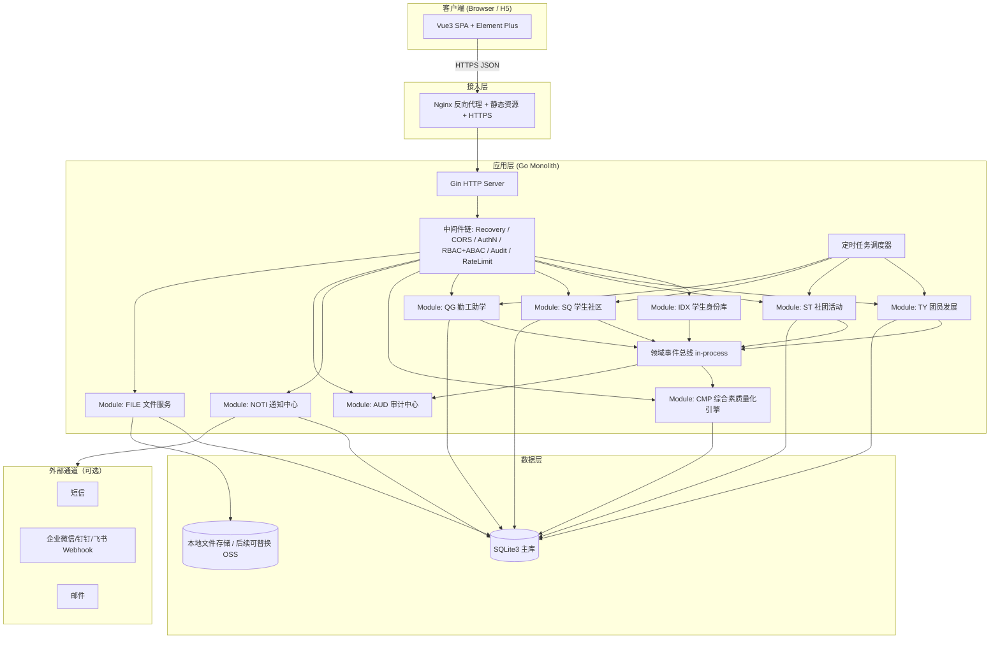

# 学生"一站式"自主管理过程管理系统 · 架构决策记录 (ADR) 与工程规范书

| 文档版本 | 修订日期       | 编写者             | 文档状态   |
| -------- | -------------- | ------------------ | ---------- |
| V1.0     | 2026-06-14     | 首席架构师 (CTO)   | 评审稿     |

> **文档目的**：作为系统架构的"宪法级"文件，记录所有关键技术选型与工程规范，所有研发、测试、运维活动须严格遵循。
> **范围**：覆盖后端（Go + Gin + GORM + SQLite3）、前端（Vue3 + Vite + Element Plus）、工程化、CI/CD、安全合规等。
> **配套文档**：[01_PRD.md](./01_PRD.md)

---

## 目录

- [0. 文档说明](#0-文档说明)
- [1. 总体架构](#1-总体架构)
- [2. ADR 决策记录](#2-adr-决策记录)
  - [ADR-001 后端语言与框架](#adr-001-后端语言与框架)
  - [ADR-002 前端框架与 UI 库](#adr-002-前端框架与-ui-库)
  - [ADR-003 数据库与 ORM](#adr-003-数据库与-orm)
  - [ADR-004 整体架构风格](#adr-004-整体架构风格)
  - [ADR-005 鉴权与单点登录](#adr-005-鉴权与单点登录)
  - [ADR-006 权限模型（RBAC + ABAC）](#adr-006-权限模型rbac--abac)
  - [ADR-007 状态机实现方案](#adr-007-状态机实现方案)
  - [ADR-008 过程档案与事件溯源](#adr-008-过程档案与事件溯源)
  - [ADR-009 API 风格与版本管理](#adr-009-api-风格与版本管理)
  - [ADR-010 前后端通信](#adr-010-前后端通信)
  - [ADR-011 加密与脱敏](#adr-011-加密与脱敏)
  - [ADR-012 审计日志](#adr-012-审计日志)
  - [ADR-013 业务编号生成器](#adr-013-业务编号生成器)
  - [ADR-014 文件存储](#adr-014-文件存储)
  - [ADR-015 通知与消息通道](#adr-015-通知与消息通道)
  - [ADR-016 定时任务与批处理](#adr-016-定时任务与批处理)
  - [ADR-017 缓存策略](#adr-017-缓存策略)
  - [ADR-018 错误处理规范](#adr-018-错误处理规范)
  - [ADR-019 配置管理](#adr-019-配置管理)
  - [ADR-020 可观测性（Logs/Metrics/Trace）](#adr-020-可观测性logsmetricstrace)
- [3. 工程规范](#3-工程规范)
  - [3.1 仓库与目录结构](#31-仓库与目录结构)
  - [3.2 命名规范](#32-命名规范)
  - [3.3 Git 工作流](#33-git-工作流)
  - [3.4 代码风格与质量门禁](#34-代码风格与质量门禁)
  - [3.5 分支与发布策略](#35-分支与发布策略)
  - [3.6 API 设计规范](#36-api-设计规范)
  - [3.7 数据库规范](#37-数据库规范)
  - [3.8 前端规范](#38-前端规范)
  - [3.9 测试规范](#39-测试规范)
  - [3.10 日志规范](#310-日志规范)
  - [3.11 安全规范](#311-安全规范)
  - [3.12 文档规范](#312-文档规范)
- [4. 模块化设计指南](#4-模块化设计指南)
- [5. 部署与运维](#5-部署与运维)
- [6. 风险与权衡总览](#6-风险与权衡总览)
- [7. 附录](#7-附录)

---

## 0. 文档说明

### 0.1 决策状态机

| 状态 | 含义 |
| ---- | ---- |
| `Proposed` | 提议中，待评审 |
| `Accepted` | 已接受，作为执行依据 |
| `Deprecated` | 已废弃，但保留记录 |
| `Superseded` | 被新决策替代，附链接 |

### 0.2 评审与变更

- 所有 ADR 变更须经 **架构评审委员会**（CTO + 后端 TL + 前端 TL + 测试 TL）一致通过。
- 重大变更须同步更新本文档与 [01_PRD.md](./01_PRD.md)。

### 0.3 与 PRD 的关系

| 维度 | PRD | ADR |
| ---- | --- | --- |
| 关注 | 业务需求、流程、规则 | 技术实现、选型、规范 |
| 读者 | 业务方、产品、设计 | 研发、测试、运维 |
| 变更 | 由 CPO 主导 | 由 CTO 主导 |
| 一致性 | ADR 必须满足 PRD 的所有约束；PRD 变更时须评估 ADR 影响 | |

---

## 1. 总体架构

### 1.1 架构总览图



### 1.2 关键架构特性

| 特性 | 描述 |
| ---- | ---- |
| 部署形态 | 单体应用（Modular Monolith），按业务模块物理分包，未来可平滑拆分 |
| 数据存储 | SQLite3 单库文件，支持后期切换到 PostgreSQL/MySQL（通过 GORM 抽象） |
| 通信 | 内部 in-process 事件总线；对外 RESTful JSON |
| 前端 | SPA + 路由懒加载 + 字典驱动 |
| 鉴权 | JWT (Access + Refresh) + RBAC + ABAC |
| 审计 | 强制中间件，状态变更全量留痕 |

### 1.3 模块清单

| 模块代号 | 名称 | 端口/路径前缀 | 备注 |
| -------- | ---- | -------------- | ---- |
| IDX | 学生身份库 | `/api/v1/idx/*` | 单一学生主体，全模块依赖 |
| TY | 团员发展 | `/api/v1/ty/*` | |
| ST | 社团活动 | `/api/v1/st/*` | |
| SQ | 学生社区与自治 | `/api/v1/sq/*` | |
| QG | 勤工助学 | `/api/v1/qg/*` | |
| CMP | 综合素质量化 | `/api/v1/cmp/*` | 读多写少 |
| NOTI | 通知中心 | `/api/v1/noti/*` | 站内 + 外部通道 |
| AUD | 审计中心 | `/api/v1/aud/*` | 内部 API + 报表 |
| FILE | 文件服务 | `/api/v1/file/*` | 上传/下载/签名 URL |
| SYS | 系统管理 | `/api/v1/sys/*` | 字典、流程配置、用户/角色 |

---

## 2. ADR 决策记录

> 每个 ADR 包含：**背景 → 决策 → 理由 → 备选方案 → 取舍 → 影响**。

---

### ADR-001 后端语言与框架

| 项 | 内容 |
| --- | --- |
| 状态 | `Accepted` (Supersedes Go/Gin) |
| 日期 | 2026-07-20 |

**背景**：系统需要强类型、生态成熟、易于团队协作、且具备丰富 ORM 与安全组件支持的后端主框架，适应五大模块强业务规则与 AI/文件存储接入。

**决策**：使用 **Java 21 LTS** + **Spring Boot 3.3.14** + **MyBatis-Plus 3.5.7**。

**理由**：
1. **Java 21 LTS 强类型与高性能**：虚拟线程与现代 Java 语法，大幅提升开发效率与并发吞吐量；
2. **Spring Boot 3 企业级生态**：成熟的 IoC / AOP、统一响应封包与自动配置支持；
3. **MyBatis-Plus 强大 ORM 抽象**：免去繁琐 CRUD 编写，支持复杂的动态 SQL 构造与逻辑删除；
4. **与 Sa-Token 及 AI 深度集成**：无缝对接 Sa-Token 轻量级鉴权与 DeepSeek LLM 智能评语生成。

**备选方案**：
| 方案 | 优势 | 劣势 | 结论 |
| ---- | ---- | ---- | ---- |
| Java 21 + Spring Boot 3 | 生态最丰富、研发效能高 | 启动与内存占用稍高 | **首选方案** |
| Go + Gin | 部署包小、启动快 | 缺少成熟的企业级生态与 AOP 切面 | `Superseded` |
| Python + FastAPI | 开发快 | 性能与强类型约束弱 | 备选 |

**影响**：
- 后端构建工具统一使用 **Maven 3.9+**；
- 所有业务 Controller 遵守标准 RESTful 响应契约 `com.studenthub.common.R`。

---

### ADR-002 前端框架与 UI 库

| 项 | 内容 |
| --- | --- |
| 状态 | `Accepted` |
| 日期 | 2026-06-14 |

**决策**：**Vue 3.4+** + **`<script setup>`** + **Vite 5+** + **Element Plus 2.7+** + **TypeScript 5+** + **Pinia 2+** + **Vue Router 4+**。

**理由**：
1. Vue3 Composition API 逻辑复用优于 Options API；
2. Vite 启动 < 1s，HMR 极佳，利于长期演进；
3. Element Plus 组件丰富，覆盖 4 大模块所需的表单/表格/树/审批流；
4. Pinia 替代 Vuex，类型友好，与 TS 结合度高。

**备选方案**：
| 方案 | 优势 | 劣势 | 结论 |
| ---- | ---- | ---- | ---- |
| React + Antd | 生态最大 | 学习曲线与心智负担 | 备选 |
| Vue2 + Webpack | 团队熟悉 | 已停止维护 | 弃 |
| Svelte | 轻量 | 生态弱，Element 无对应库 | 备选 |

**影响**：
- 全量启用 TS，配置文件 `tsconfig.json` 严格模式；
- 状态管理统一 Pinia，禁用 Vuex；
- 表单组件优先使用 Element Plus + `el-form` 校验机制。

---

### ADR-003 数据库与 ORM

| 项 | 内容 |
| --- | --- |
| 状态 | `Accepted` |
| 日期 | 2026-06-14 |

**决策**：**SQLite3**（开发与初期生产）+ **GORM v2**。

**理由**：
1. **单文件部署**：契合教学/校内场景的"零运维"诉求；
2. **ACID + 事务**：完全满足本系统的强一致性需求；
3. **GORM 抽象**：未来切换到 PostgreSQL/MySQL 仅需更换 driver；
4. **WAL 模式**：并发读写性能可控。

**备选方案**：
| 方案 | 优势 | 劣势 | 结论 |
| ---- | ---- | ---- | ---- |
| PostgreSQL | 强大事务与扩展 | 需独立部署 | 备选（规模化后切换） |
| MySQL | 生态成熟 | 配置成本高 | 备选 |
| LevelDB / BoltDB | 嵌入 KV | 关系能力弱 | 弃 |

**影响**：
- 必须使用 GORM 而非裸 SQL，便于方言切换；
- 启动时开启 WAL：`PRAGMA journal_mode=WAL; PRAGMA synchronous=NORMAL; PRAGMA foreign_keys=ON;`
- 数据库文件纳入备份策略，保留 ≥ 30 天；
- 禁止使用 SQLite 不支持的特性（如 `FOR UPDATE SKIP LOCKED` 的等价语法需用事务隔离替代）。

---

### ADR-004 整体架构风格

| 项 | 内容 |
| --- | --- |
| 状态 | `Accepted` |
| 日期 | 2026-06-14 |

**决策**：**Modular Monolith（模块化单体）** + **in-process 事件总线**。

**理由**：
1. 4 大模块共享同一"学生主体"，强耦合业务（综合素质量化、过程档案）天然适合单体；
2. 模块边界由 **Go package + 目录结构** 强制约束；
3. in-process 事件总线降低复杂度，未来可平滑替换为 NATS/Kafka；
4. 单体部署、单库，避免分布式事务、跨库 JOIN 难题。

**备选方案**：
| 方案 | 优势 | 劣势 | 结论 |
| ---- | ---- | ---- | ---- |
| 微服务 | 独立伸缩 | 分布式事务、运维成本 | 不适合当前阶段 |
| Serverless | 按量计费 | 冷启动、状态管理复杂 | 不适合 |

**影响**：
- 模块之间**只能**通过：
  - 公开服务接口（pkg/module/X）
  - 领域事件
  禁止直接访问其他模块的内部表/结构体。
- 出现"跨模块事务"时，优先使用 **Saga 编排式事务**（事件补偿），禁止跨模块的"大事务"。

---

### ADR-005 鉴权与单点登录

| 项 | 内容 |
| --- | --- |
| 状态 | `Accepted` |
| 日期 | 2026-06-14 |

**决策**：**JWT (HS256)** + **Access Token (15min) + Refresh Token (7d, HttpOnly Cookie)**。

**理由**：
1. 校园场景无强 SSO 需求（如对接 CAS），但预留接口；
2. 双 Token 兼顾安全与体验；
3. Refresh Token 存于 HttpOnly + SameSite=Strict Cookie，XSS 风险低。

**Token Claims (示例)**：
```json
{
  "sub": "20231001",
  "uid": 1024,
  "name": "张三",
  "roles": ["R-STU-NORM", "R-STU-LEAGUE"],
  "orgs": [{"type": "class", "id": "CS2301"}, {"type": "dorm", "id": "B-3-201"}],
  "iat": 1718332800,
  "exp": 1718333700,
  "iss": "studenthub",
  "jti": "uuid-v7"
}
```

**影响**：
- 登录密码使用 **bcrypt cost=12**；
- 强制 HTTPS（生产环境）；
- Refresh Token 须支持 **轮换** 与 **黑名单**（Redis/内存 LRU，初期可使用进程内 LRU）。

**决策细化（2026-06-23 落地版）**：
- Refresh Token 黑名单采用 **进程内 LRU**（`hashicorp/golang-lru/v2`），key = `jti`，value = 过期时间；
- 配合 `sys_user.token_version`（INT）做"整人作废"：改密、禁用账号、强制下线时 `token_version + 1`；
- 校验链路：`ParseAccess` / `ParseRefresh` 后，**必须** 同时满足 `token_version == user.token_version` 且 `jti` 不在黑名单内；任一不满足返回 `40103 RT_REVOKED`；
- 服务重启后黑名单清空，但 7d TTL 与 token_version 自增保证安全窗口可控。

---

### ADR-006 权限模型（RBAC + ABAC）

| 项 | 内容 |
| --- | --- |
| 状态 | `Accepted` |
| 日期 | 2026-06-14 |

**决策**：**RBAC（角色）+ ABAC（属性）混合**。

**模型**：
- **角色 (Role)**：参见 PRD §2.1，含校级、院系级、学生级；
- **资源 (Resource)**：每个业务实体（社团、活动、岗位…）；
- **动作 (Action)**：`create / read / update / delete / approve / reject / export`；
- **属性 (Attribute)**：用户所属院系/支部/楼栋/时间窗/IP/设备指纹等。

**策略表达**（伪代码）：
```
can(user, "approve", activity) :-
  user.role ∈ {R-COL-ADMIN, R-COL-TUTOR, R-SY-ADMIN}
  AND
  if user.role == R-COL-ADMIN: activity.collegeId == user.collegeId
  if user.role == R-COL-TUTOR: activity.tutorId == user.uid
  if user.role == R-SY-ADMIN:   true
  AND
  activity.level in approvalScope(user.role)
  AND
  now() in workingHours(user.role) OR user.role == R-SY-ADMIN
```

**实现**：
- 使用 **Casbin (gorm-adapter)** 作为策略引擎；
- 策略文件 `internal/accessx/policies/*.csv`；
- 在 Gin 中间件层做"零业务侵入"校验。

**影响**：
- 任何新增 API 必须登记 `Resource × Action × Role` 矩阵；
- ABAC 规则须有单测覆盖边界（跨院系、越权读等）。

---

### ADR-007 状态机实现方案

| 项 | 内容 |
| --- | --- |
| 状态 | `Accepted` |
| 日期 | 2026-06-14 |

**决策**：使用轻量自研状态机（基于 enum + 转移表），**不引入**第三方重型引擎。

**理由**：
1. 4 大模块状态机虽有差异，但均可抽象为 `(ObjectType, FromState, ToState, Action, Guard, Effect)`；
2. 第三方引擎（如 Temporal）增加运维负担；
3. 状态转移必须**显式记录审计**，自研便于统一埋点。

**核心数据结构**：
```go
type Transition struct {
    From   string
    To     string
    Action string
    Guard  func(ctx *BizCtx) error
    Effect func(ctx *BizCtx) error
}
```

**使用示例（伪代码）**：
```go
sm := statem.New("TY-Application").
    Define("S0", "S1", "submit", guardNotExistPending, effectAssignCode).
    Define("S1", "S2", "approve", guardInRole(R-COL-ADMIN), effect...).
    Define("S2", "S3", "final",   guardInRole(R-SY-ADMIN), effectEmitEvent)
app.Allow("S1", "S0", "withdraw") // 撤回

err := sm.Apply(ctx, bizObj, "approve", payload)
```

**影响**：
- 任何状态变更必须经过 `statem.Apply()`，**禁止**业务代码直接 `UPDATE status=...`；
- Guard 失败必须返回 `BizError`（带错误码 + 业务码 + 友好消息）。

---

### ADR-008 过程档案与事件溯源

| 项 | 内容 |
| --- | --- |
| 状态 | `Accepted`（精简版 Event Sourcing） |
| 日期 | 2026-06-14 |

**决策**：以**事件日志 + 当前态投影**的混合模式支撑"学生过程档案"。

**模式说明**：
- 每一次状态变更、关键业务事件写入 `event_log`（append-only）；
- 业务表保存"当前态"用于高效查询；
- 不做完整 CQRS（避免复杂度），但保留事件表供追溯、量化、审计。

**事件表结构**：
```sql
CREATE TABLE event_log (
    id            INTEGER PRIMARY KEY AUTOINCREMENT,
    event_id      TEXT NOT NULL UNIQUE,        -- UUID v7
    aggregate     TEXT NOT NULL,               -- "student" / "ty.application"
    aggregate_id  TEXT NOT NULL,               -- "20231001" / "TY-2026-0001"
    event_type    TEXT NOT NULL,               -- "TyApplicationSubmitted"
    actor_id      INTEGER NOT NULL,
    actor_role    TEXT NOT NULL,
    payload_json  TEXT NOT NULL,               -- 事件内容
    prev_hash     TEXT,                        -- 链式完整性
    hash          TEXT NOT NULL,
    occurred_at   DATETIME NOT NULL,
    ip            TEXT,
    ua            TEXT,
    module        TEXT NOT NULL,               -- TY/ST/SQ/QG
    biz_no        TEXT                         -- 业务编号
);
CREATE INDEX idx_event_aggregate ON event_log(aggregate, aggregate_id, occurred_at);
CREATE INDEX idx_event_module    ON event_log(module, occurred_at);
```

**影响**：
- 任何跨模块"画像"读取均基于事件表 + 物化视图；
- 严禁物理删除事件；
- 提供定期（每日）一致性巡检脚本。

---

### ADR-009 API 风格与版本管理

| 项 | 内容 |
| --- | --- |
| 状态 | `Accepted` |
| 日期 | 2026-06-14 |

**决策**：**RESTful** + **URL 路径版本**（`/api/v1/...`）。

**约定**：
- 资源名复数：`/activities`、`/applications`；
- 动宾结构用于"非纯 CRUD"操作：`POST /activities/{id}/submit`；
- HTTP 语义：`GET(幂等读) / POST(创建或动作) / PUT(全量更新) / PATCH(部分更新) / DELETE(删除)`；
- **状态变更**统一使用 `POST {collection}/{id}/{action}` 端点，避免 PATCH 状态机字段。

**统一响应体**：
```json
{
  "code": 0,                  // 0 成功；非 0 业务错误
  "message": "ok",
  "data": { ... },
  "trace_id": "8e1c7..."
}
```

**错误码体系**：
| 段 | 含义 |
| --- | --- |
| 0 | 成功 |
| 1xxx | 通用错误（参数、权限、系统） |
| 2xxx | TY 模块 |
| 3xxx | ST 模块 |
| 4xxx | SQ 模块 |
| 5xxx | QG 模块 |
| 6xxx | CMP / NOTI / FILE / SYS |

详见 [3.6 API 设计规范](#36-api-设计规范)。

---

### ADR-010 前后端通信

| 项 | 内容 |
| --- | --- |
| 状态 | `Accepted` |
| 日期 | 2026-06-14 |

**决策**：
- 协议：**HTTPS + JSON**；
- 分页：`?page=1&page_size=20`，响应体 `data.list` + `data.total`；
- 排序：`?sort=created_at:desc,id:asc`；
- 过滤：与 `q[field]=value` 风格，复杂过滤使用 `POST /search`；
- 文件上传：`multipart/form-data` + 预签名 URL 模式（见 ADR-014）；
- 时区：所有时间字段后端以 **RFC3339 + +08:00** 序列化。

**影响**：
- 禁止前端使用 cookie 传敏感 token；
- 启用 GZIP；
- 列表接口默认上限 `page_size <= 200`，超出报错。

---

### ADR-011 加密与脱敏

| 项 | 内容 |
| --- | --- |
| 状态 | `Accepted` |
| 日期 | 2026-06-14 |

**决策**：
- **静态加密**：身份证号、银行卡号、家庭经济信息使用 **AES-256-GCM**；
  - 密钥通过环境变量 `APP_DATA_KEY` 注入；
  - 每个字段加随机 IV，密文格式 `base64(iv|cipher|tag)`；
- **传输加密**：生产强制 HTTPS；
- **脱敏**：列表/导出场景按角色脱敏（如身份证显示 `110***********0023`）；
- **密码**：bcrypt cost=12，禁止明文日志。

**影响**：
- 加密/解密统一通过 `pkg/cryptox` 工具类，**禁止**散落实现；
- 字段级脱敏在序列化层（自定义 JSON Marshal）处理，避免业务层遗漏。

---

### ADR-012 审计日志

| 项 | 内容 |
| --- | --- |
| 状态 | `Accepted` |
| 日期 | 2026-06-14 |

**决策**：双层审计：
1. **应用审计**（业务事件，存于 `event_log`，见 ADR-008）；
2. **访问审计**（API 调用，存于 `audit_log`，由 Gin 中间件统一写入）。

**访问审计字段**：
```sql
CREATE TABLE audit_log (
    id            INTEGER PRIMARY KEY AUTOINCREMENT,
    ts            DATETIME NOT NULL,
    actor_id      INTEGER,
    role          TEXT,
    method        TEXT,
    path          TEXT,
    status        INTEGER,
    latency_ms    INTEGER,
    ip            TEXT,
    ua            TEXT,
    request_id    TEXT,
    biz_no        TEXT
);
```

**影响**：
- 任何修改 S0→S1、S2→S3、S3→S4 的 API 必须经过 `audit.Middleware`；
- 审计保留期 ≥ 5 年。

---

### ADR-013 业务编号生成器

| 项 | 内容 |
| --- | --- |
| 状态 | `Accepted` |
| 日期 | 2026-06-14 |

**决策**：`<MODULE>-<YYYY>-<4位流水>`，按"模块 + 年份"独立序列。

**实现**：
- 使用 `biz_seq` 表 + 事务保证原子性：
```sql
CREATE TABLE biz_seq (
    module   TEXT NOT NULL,
    year     INTEGER NOT NULL,
    cur      INTEGER NOT NULL DEFAULT 0,
    PRIMARY KEY (module, year)
);
```
- 取号函数 `NextBizNo(ctx, module) string`：
  - `BEGIN; UPDATE biz_seq SET cur=cur+1 WHERE module=? AND year=? RETURNING cur; COMMIT;`
  - 返回 `fmt.Sprintf("%s-%d-%04d", module, year, cur)`。

**影响**：
- 流水号 4 位（年内最大 9999）足以满足校内场景；
- 跨年从 0 重新计数。

---

### ADR-014 文件存储

| 项 | 内容 |
| --- | --- |
| 状态 | `Accepted`（V1 本地；预留 OSS） |
| 日期 | 2026-06-14 |

**决策**：
- V1：本地文件系统 `./storage/{yyyy}/{mm}/{uuid}.{ext}`；
- 接口：`POST /api/v1/file/upload` → 返回 `{key, url, hash, size}`；
- 下载：通过 `GET /api/v1/file/{key}?token=...` 鉴权后返回；
- 后续替换：定义 `Storage` interface，本地实现 → OSS/七牛/阿里云。

**影响**：
- 文件元数据存于 `file_meta` 表；
- 上传做 MIME 白名单 + 病毒扫描预留（V1 仅做大小/MIME 校验）；
- 单文件 ≤ 50MB（可配置）。

---

### ADR-015 通知与消息通道

| 项 | 内容 |
| --- | --- |
| 状态 | `Accepted` |
| 日期 | 2026-06-14 |

**决策**：
- **站内信**：必选，存于 `notification` 表；
- **短信 / 邮件 / 企微 / 钉钉**：通过 `pkg/notify` 适配，**接口 + 通道实现**分离；
- **L4 事件**：三重通道并行（短信 + 企微 + 站内）；
- 通知发送采用 **outbox 模式**（事件日志 + 定时扫描）保证最终一致性。

**影响**：
- 通知失败不阻塞业务主流程；
- 重要通知（薪酬到账、L4 事件）须有 **重试 + 人工兜底**。

---

### ADR-016 定时任务与批处理

| 项 | 内容 |
| --- | --- |
| 状态 | `Accepted` |
| 日期 | 2026-06-14 |

**决策**：使用 [robfig/cron v3](https://github.com/robfig/cron) 内嵌调度器。

**典型任务**：
| 名称 | Cron | 用途 |
| ---- | ---- | ---- |
| `audit_clean` | 0 3 * * * | 临时日志清理（按规则归档） |
| `bizseq_init` | 0 0 1 1 * | 年初重置流水表 |
| `ty_overdue_warn` | 0 9 * * * | 培养记录超期预警 |
| `qg_payroll_gen` | 0 2 1 * * | 月度薪酬初稿生成 |
| `sq_late_alert` | */30 22-23 * * * | 晚归统计推送 |
| `cmp_recompute` | 0 2 * * * | 综合素质量化分重算 |

**影响**：
- 任务须**幂等**；
- 任务执行写 `job_run` 日志（开始/结束/耗时/结果）。

---

### ADR-017 缓存策略

| 项 | 内容 |
| --- | --- |
| 状态 | `Accepted` |
| 日期 | 2026-06-14 |

**决策**：
- V1 使用**进程内 LRU**（[hashicorp/golang-lru](https://github.com/hashicorp/golang-lru)）；
- 缓存对象：**字典数据**、**RBAC 策略**、**当前学期常量**、**用户基础信息**；
- 失效：写操作 → 主动 `Invalidate(key)`；
- TTL 默认 5 分钟；
- 后续按需引入 Redis。

**影响**：
- 业务层禁止直接调用 LRU，统一通过 `pkg/cachex`；
- 缓存 key 命名：`{module}:{entity}:{id}`。

---

### ADR-018 错误处理规范

| 项 | 内容 |
| --- | --- |
| 状态 | `Accepted` |
| 日期 | 2026-06-14 |

**决策**：
- 后端统一通过 `BizError` 结构传递业务错误；
- 错误码 = `code`（5 位） + `bizCode`（业务码） + `httpStatus`；
- 全局异常中间件把 `BizError` 转换为标准响应；
- 未知错误返回 `code=1500, httpStatus=500`，不泄露堆栈。

**定义**：
```go
type BizError struct {
    Code      int    // 业务码 1xxx/2xxx...
    BizCode   string // 业务可读码 e.g. "TY.APPLICATION.AGE_OUT_OF_RANGE"
    Message   string // 中文友好消息
    HTTPStatus int
    Cause     error  // 可选
}
func (e *BizError) Error() string { return e.BizCode + ": " + e.Message }
```

**前端处理**：
- 弹 `ElMessage` 提示；
- `code==401` → 跳转登录；
- `code==403` → 跳转无权限页；
- `code>=500` → 全局错误页 + trace_id 提示。

---

### ADR-019 配置管理

| 项 | 内容 |
| --- | --- |
| 状态 | `Accepted` |
| 日期 | 2026-06-14 |

**决策**：
- 使用 [spf13/viper](https://github.com/spf13/viper)；
- 优先级：环境变量 > `config.local.yaml` > `config.yaml`；
- 敏感配置（数据库密钥、JWT 密钥、加密 Key）**只**通过环境变量；
- 启动校验：必填项缺失直接 fatal。

**示例**：
```yaml
app:
  env: dev
  port: 8080
db:
  path: ./data/studenthub.db
jwt:
  access_ttl: 15m
  refresh_ttl: 168h
  issuer: studenthub
data_key: ""  # 必填，从 env 注入
```

---

### ADR-020 可观测性（Logs/Metrics/Trace）

| 项 | 内容 |
| --- | --- |
| 状态 | `Accepted` |
| 日期 | 2026-06-14 |

**决策**：
- 日志：[uber-go/zap](https://github.com/uber-go/zap) 结构化 JSON 日志；
- 指标：内置 `/metrics`（Prometheus 格式），关键指标：QPS / p95 / 错误率 / 状态机迁移次数；
- 链路追踪：V1 仅生成 `X-Request-ID`（UUID v7），日志与审计关联；后续接 OpenTelemetry。

**影响**：
- 关键路径必须打日志（开始/结束/异常）；
- 业务日志禁止打印身份证、银行卡等敏感字段。

---

## 3. 工程规范

### 3.1 仓库与目录结构

采用 **单仓多模块 (Monorepo)**：

```
studenthub/
├── cmd/
│   └── server/
│       └── main.go
├── internal/                # 业务代码（禁止外部 import）
│   ├── boot/                # 启动装配
│   ├── middleware/          # Gin 中间件
│   ├── router/              # 路由注册
│   ├── accessx/             # 权限 (Casbin)
│   ├── auditx/              # 审计
│   ├── statem/              # 状态机
│   ├── eventx/              # 事件总线
│   ├── notifyx/             # 通知
│   ├── cachex/              # 缓存
│   ├── cryptox/             # 加密/脱敏
│   ├── idgen/               # 业务编号
│   └── modules/             # 业务模块
│       ├── idx/             # 学生身份库
│       │   ├── api/
│       │   ├── service/
│       │   ├── repository/
│       │   ├── model/
│       │   ├── event/
│       │   └── module.go    # Module 注册入口
│       ├── ty/              # 团员发展
│       ├── st/              # 社团活动
│       ├── sq/              # 学生社区
│       ├── qg/              # 勤工助学
│       ├── cmp/             # 综合素质量化
│       ├── noti/            # 通知
│       ├── aud/             # 审计
│       ├── file/            # 文件
│       └── sys/             # 系统
├── pkg/                     # 可外暴露工具库
│   ├── logger/
│   ├── errs/
│   ├── pagination/
│   ├── timex/
│   └── validator/
├── configs/
│   ├── config.yaml
│   └── policies/            # Casbin 策略
├── data/                    # SQLite 文件、文件存储目录
├── scripts/                 # 构建/数据迁移/工具脚本
├── web/                     # 前端工程
│   ├── src/
│   │   ├── api/
│   │   ├── components/
│   │   ├── composables/
│   │   ├── layouts/
│   │   ├── modules/         # 与后端模块一一对应
│   │   ├── router/
│   │   ├── stores/          # Pinia
│   │   ├── types/
│   │   ├── utils/
│   │   ├── views/
│   │   ├── App.vue
│   │   └── main.ts
│   ├── public/
│   ├── tests/
│   ├── index.html
│   ├── vite.config.ts
│   ├── tsconfig.json
│   └── package.json
├── docs/                    # 项目文档
│   ├── 01_PRD.md
│   ├── 02_ADR.md
│   └── 03_API.md            # 自动生成
├── tools/                   # 代码生成器、迁移工具
├── .editorconfig
├── .gitignore
├── .golangci.yml
├── .prettierrc
├── .eslintrc.cjs
├── go.mod
├── go.sum
├── Makefile
└── README.md
```

**关键约束**：
- `internal/` 下的包**禁止**被 `cmd` 之外的目录引用；
- `pkg/` 是允许外部 import 的稳定 API；
- 任何模块访问数据库**只能**通过自己的 `repository`。

---

### 3.2 命名规范

| 类型 | 规则 | 示例 |
| ---- | ---- | ---- |
| 包名 | 小写单词 | `modules/ty/service` |
| 文件名 | 蛇形 | `application_service.go` |
| 结构体 | 大驼峰 | `ApplicationService` |
| 接口 | 大驼峰 + 行为名 | `ApplicationRepository` |
| 方法 | 大驼峰 | `Submit(ctx, dto)` |
| 局部变量 | 小驼峰 | `bizNo string` |
| 常量 | 大驼峰或全大写 | `StatusActive = "S3"` |
| 数据库表 | 模块代码前缀蛇形 | `ty_application`、`st_activity` |
| 数据库字段 | 蛇形 | `created_at` |
| 索引 | `idx_{table}_{col1}_{col2}` | `idx_ty_app_student_id_year` |
| API 路径 | 复数名词 | `/api/v1/ty/applications` |
| 事件名 | 大驼峰 + 过去式 | `TyApplicationSubmitted` |
| 错误码 | 数字 | `2401` |
| 前端组件 | 大驼峰 | `TyApplicationForm.vue` |
| 前端 store | use + 大驼峰 | `useUserStore` |
| 前端 API | use + Entity + Api | `useApplicationApi()` |

---

### 3.3 Git 工作流

**模型**：**Trunk-Based + 短期特性分支**（轻量 GitFlow）。

| 分支 | 用途 | 命名 |
| ---- | ---- | ---- |
| `main` | 生产 | - |
| `develop` | 集成 | - |
| `feature/*` | 特性 | `feature/ty-2026-submit` |
| `fix/*` | 缺陷 | `fix/qg-payroll-decimal` |
| `chore/*` | 杂项 | `chore/dep-bump-gorm` |
| `release/*` | 发布准备 | `release/v1.2.0` |
| `hotfix/*` | 生产热修 | `hotfix/login-401-loop` |

**提交规范（Conventional Commits）**：
```
<type>(<scope>): <subject>
```
- type: `feat / fix / refactor / perf / docs / test / chore / build / ci`
- 例：`feat(ty): 支持推优大会到会率硬卡控`

**Code Review**：
- 至少 1 名同模块同事 + 1 名 TL；
- 单 PR ≤ 600 行净增；
- 必须通过 CI 全量门禁（lint / unit / build）。

---

### 3.4 代码风格与质量门禁

#### 3.4.1 Go
- `gofmt` / `goimports` 强制；
- `golangci-lint` 配置 `.golangci.yml`：`govet / staticcheck / errcheck / ineffassign / gofmt / goimports / revive / gocyclo(≤20) / gocognit(≤25) / bodyclose / misspell / prealloc / sqlclosecheck`；
- 函数圈复杂度 ≤ 20，认知复杂度 ≤ 25；
- 单元测试覆盖率：模块核心 `service` ≥ 70%；
- 不允许 `panic` 出现在业务代码中（仅 `cmd/boot` 启动校验用）；
- 不允许 `_ = err` 静默吞错；
- `error` 必须 wrap 传上下文：`fmt.Errorf("submit application: %w", err)`。

#### 3.4.2 Vue / TS
- ESLint + Prettier + `eslint-plugin-vue` (vue3-recommended) + `@typescript-eslint`；
- 强制 `script setup` + `defineProps` 泛型化；
- 不使用 `any`（`unknown` + 守卫代替）；
- 组件 props 必填项使用 `required: true`；
- 单元测试：[Vitest](https://vitest.dev/) + [Vue Test Utils](https://test-utils.vuejs.org/)。

#### 3.4.3 通用
- 提交前必须 `pre-commit` 跑 lint + format（[lefthook](https://github.com/evilmartians/lefthook)）；
- 模板项目内置 `.editorconfig`。

---

### 3.5 分支与发布策略

| 环境 | 来源 | 触发 |
| ---- | ---- | ---- |
| dev | `develop` | push 自动部署 |
| staging | `release/*` | 手动 + tag |
| prod | `main` | tag `vX.Y.Z` |

- 版本号遵循 SemVer：`MAJOR.MINOR.PATCH`；
- CHANGELOG 自动从 Conventional Commits 生成（[git-cliff](https://git-cliff.org/)）；
- 数据库迁移：**向前兼容**（新增列允许为空，旧列不删除只标记废弃）。

---

### 3.6 API 设计规范

#### 3.6.1 URL 规范
- 全部小写、复数；
- 嵌套资源最多 2 层：`/classes/{id}/students`；
- 过滤参数 `q[field]=value`，如：`?q[status]=S1&q[year]=2026`；
- 排序 `sort=field1:asc,field2:desc`；
- 字段裁剪 `fields=id,name,code`。

#### 3.6.2 请求/响应
- 请求体：JSON；
- 时间字段：`RFC3339 with timezone`；
- 分页响应：
```json
{
  "code": 0,
  "data": {
    "list": [...],
    "total": 123,
    "page": 1,
    "page_size": 20
  },
  "trace_id": "..."
}
```

#### 3.6.3 错误响应
```json
{
  "code": 2401,
  "message": "申请人年龄超出 14–28 周岁范围",
  "biz_code": "TY.APPLICATION.AGE_OUT_OF_RANGE",
  "trace_id": "8e1c7..."
}
```

#### 3.6.4 业务错误码规范
| 段 | 模块 |
| --- | --- |
| 1000–1099 | 通用（参数、权限、系统） |
| 1100–1199 | IDX |
| 2000–2099 | TY 团员发展 |
| 3000–3099 | ST 社团活动 |
| 4000–4099 | SQ 学生社区 |
| 5000–5099 | QG 勤工助学 |
| 6000–6099 | CMP |
| 7000–7099 | NOTI |
| 8000–8099 | FILE |
| 9000–9099 | SYS |

子错误码细分（如 `2401`）由各模块维护。

#### 3.6.5 接口幂等
- 写接口支持 `Idempotency-Key` Header；
- 相同 key 24 小时内返回首次结果。

---

### 3.7 数据库规范

#### 3.7.1 通用字段（每张业务表必须）
```sql
id          INTEGER PRIMARY KEY AUTOINCREMENT,
created_at  DATETIME NOT NULL DEFAULT CURRENT_TIMESTAMP,
updated_at  DATETIME NOT NULL DEFAULT CURRENT_TIMESTAMP,
created_by  INTEGER,
updated_by  INTEGER,
is_deleted  INTEGER NOT NULL DEFAULT 0   -- 软删
```

#### 3.7.2 命名
- 表：`{module}_{entity}`，如 `ty_application`、`st_activity`；
- 主键：`id`；
- 外键：`{ref_table_singular}_id`（如 `student_id`、`activity_id`）；
- 业务编号：`biz_no`（unique）。

#### 3.7.3 索引
- 高频查询字段必建索引；
- 复合索引遵循"最左前缀"；
- 文本字段使用 FTS5 全文索引（如思想汇报、政策文件）。

#### 3.7.4 迁移
- 工具：[pressly/goose](https://github.com/pressly/goose)；
- 文件命名：`{ts}_{module}_{action}.sql`；
- 严禁手动改库。

#### 3.7.5 软删
- 业务查询统一通过 `repository` 过滤 `is_deleted=0`；
- 物理删除仅允许在 **定时归档任务** 中执行，且须有审计。

---

### 3.8 前端规范

#### 3.8.1 目录
- `views/`：页面级路由组件；
- `components/`：通用组件（≥ 2 处复用）；
- `modules/{module}/components/`：模块内部组件；
- `composables/`：组合式函数（如 `usePagination`）；
- `api/`：按后端模块分子目录；
- `stores/`：Pinia store；
- `types/`：与后端 DTO 对应的 TS 类型；
- `router/`：静态 + 动态注册；
- `utils/`：纯函数工具。

#### 3.8.2 命名
- 组件文件名 `PascalCase.vue`；
- 组合式函数 `useCamelCase.ts`；
- 路由 meta 必须含：`title / icon / permission / keepAlive / module`。

#### 3.8.3 状态管理
- 一个领域一个 store；
- 异步动作封装在 store 的 `action` 内；
- 不在组件中直接调用 axios，统一 `api/` 封装。

#### 3.8.4 表单
- 统一使用 `el-form` + `useForm`（自研）做受控/校验；
- 校验规则与后端 DTO 校验**同源**（如使用 zod 共享 schema）。

#### 3.8.5 权限
- 路由级：`router.beforeEach` 根据 `meta.permission` 过滤；
- 组件级：`<HasPermission perm="ty.application.create">`；
- 按钮级：`v-perm` 指令。

#### 3.8.6 国际化（V1.1 预留）
- 使用 `vue-i18n`；
- 文案 key 格式：`{module}.{entity}.{field}`；
- 字典支持双语字段（`name_zh / name_en`）。

---

### 3.9 测试规范

| 层级 | 工具 | 目标 |
| ---- | ---- | ---- |
| 单元测试 (Go) | `testing` + `testify` | service / repository 核心逻辑 ≥ 70% |
| 单元测试 (Vue) | Vitest + Vue Test Utils | composables / 关键组件 ≥ 60% |
| 集成测试 (Go) | `dockertest` 或直接 SQLite file | 跨模块协同流程 |
| API 契约测试 | `ginkgo` / 自研 | 每个端点至少 1 用例 |
| E2E | Playwright | 关键流程：推优/活动立项/工时 |
| 性能 | `k6` / `wrk` | 推优大会、招新季压测 |

**测试命名**：
- Go：`TestXxx_Method_Scenario`（如 `TestApplicationService_Submit_WhenAgeInvalid_ReturnsErr`）；
- Vue：`describe / it` 风格，文件名 `.spec.ts`。

**CI 门禁**：
- 单测覆盖率：后端 ≥ 70%，前端 ≥ 60%；
- 任意 lint 错误 → 阻断合并；
- 性能基线告警：核心接口 p95 > 1.5s 阻断发布。

---

### 3.10 日志规范

**字段**：
```json
{
  "ts": "2026-06-14T10:00:00+08:00",
  "level": "info",
  "module": "ty",
  "trace_id": "8e1c7...",
  "actor_id": 1024,
  "msg": "application submitted",
  "biz_no": "TY-2026-0001",
  "elapsed_ms": 12
}
```

**级别**：
- `debug`：开发期；
- `info`：关键业务节点（创建/审批/状态变更）；
- `warn`：可恢复异常；
- `error`：需要人工介入；
- `fatal`：进程退出前。

**约束**：
- 禁止打印：密码、token、身份证、银行卡、银行卡号、家庭经济情况；
- 日志保留 ≥ 180 天（应用日志），审计日志 ≥ 5 年。

---

### 3.11 安全规范

| 项 | 措施 |
| --- | --- |
| 注入 | GORM 参数化 + 输入校验（`go-playground/validator/v10`） |
| XSS | 前端 Vue 默认转义 + 禁用 `v-html`（白名单场景需审计） |
| CSRF | SameSite Cookie + 双 Token |
| 越权 | RBAC + ABAC 中间件；资源 ID 须校验归属 |
| 文件上传 | MIME 白名单 + 后缀白名单 + 大小限制 + 重命名 |
| 暴力破解 | 登录 5 次/15min 限流 + 验证码 |
| 越权导出 | 导出 API 二次鉴权 + 审计 |
| 敏感数据 | AES-256 字段加密 + 角色级脱敏 |
| 第三方依赖 | `go mod audit` + `npm audit` + Renovate 自动 PR |
| 配置 | `.env*` 不入仓；密钥仅经环境变量 |
| 备份 | SQLite 每日冷备 + 异地归档 30 天 |

---

### 3.12 文档规范

| 文档 | 位置 | 来源 |
| ---- | ---- | ---- |
| PRD | `docs/01_PRD.md` | CPO |
| ADR（本文） | `docs/02_ADR.md` | CTO |
| OpenAPI | `docs/03_API.md` | swag 自动生成 |
| 数据库设计 | `docs/04_DB.md` | DB 设计稿 + goose 文件 |
| 模块设计 | `docs/modules/{module}.md` | 模块负责人 |
| Runbook | `docs/runbook/*.md` | 运维 |
| CHANGELOG | `CHANGELOG.md` | git-cliff 自动生成 |

---

## 4. 模块化设计指南

### 4.1 模块边界
- 每个模块**只能**通过自身 `service` 暴露能力；
- 跨模块调用统一通过 **接口注入**（`internal/modules/ty/service` 在 `boot` 中注入到 `cmp`）；
- 不允许 **直接访问** 他人 repository / DB session。

### 4.2 模块内部结构
```
modules/ty/
├── api/             # handler / DTO / 路由注册
├── service/         # 业务编排，状态机入口
├── repository/      # GORM 数据访问
├── model/           # 实体 & 数据库映射
├── event/           # 事件定义 & 订阅
├── statemachine/    # 本模块状态机配置
└── module.go        # Module struct (Init / Start / Stop)
```

### 4.3 模块接口示例
```go
// internal/modules/ty/service/interfaces.go
type ApplicationService interface {
    Submit(ctx context.Context, dto *SubmitDTO) (*Application, error)
    Approve(ctx context.Context, id string, dto *ApproveDTO) error
    Withdraw(ctx context.Context, id string, reason string) error
}

// internal/modules/ty/module.go
type Module struct {
    App *service.ApplicationService
}

func (m *Module) Register(r *gin.RouterGroup) { ... }
```

### 4.4 事件总线
```go
// 发布
eventx.Publish(ctx, &event.TyApplicationSubmitted{
    ApplicationID: app.ID,
    StudentID:     app.StudentID,
    OccurredAt:    time.Now(),
})

// 订阅（模块启动时注册）
eventx.Subscribe("TyApplicationSubmitted", cmp.OnTyApplicationSubmitted)
```

### 4.5 综合素质量化（CMP）
- 订阅 4 大模块事件，写入物化表 `cmp_score_dim`；
- 提供"重新计算"API（管理端触发）；
- V1 同步计算，V1.1 异步批处理。

---

## 5. 部署与运维

### 5.1 部署形态
- **单机一体**：后端单进程 + 前端静态资源 + SQLite + 文件存储；
- Nginx 反代，systemd 托管。

### 5.2 启动脚本（systemd 片段）
```ini
[Service]
WorkingDirectory=/opt/studenthub
ExecStart=/opt/studenthub/bin/server
Environment=APP_ENV=prod
Environment=APP_PORT=8080
Environment=APP_DATA_KEY=***  # 由 Vault/SealedSecret 注入
Restart=on-failure
```

### 5.3 Nginx 反代示例
```nginx
server {
  listen 443 ssl http2;
  server_name studenthub.example.edu.cn;

  client_max_body_size 60m;

  location /api/ {
    proxy_pass http://127.0.0.1:8080;
    proxy_set_header X-Forwarded-For $remote_addr;
    proxy_set_header X-Request-ID $request_id;
  }

  location / {
    root /opt/studenthub/web/dist;
    try_files $uri /index.html;
  }
}
```

### 5.4 监控
- `/healthz`：健康检查；
- `/readyz`：依赖（DB/FS）就绪；
- `/metrics`：Prometheus 抓取；
- 关键告警：5xx > 1%、p95 > 2s、L4 事件 10 分钟无响应。

### 5.5 备份与恢复
- SQLite WAL 文件 + 主文件每日冷备；
- 上传文件每日 rsync 至备份卷；
- 季度演练恢复流程。

---

## 6. 风险与权衡总览

| 风险 | 等级 | 缓解措施 |
| ---- | ---- | -------- |
| 单体膨胀 | 中 | 模块目录强制 + 依赖约束 + 周期架构 review |
| SQLite 并发上限 | 中 | 启用 WAL + 业务限流；规模化时切换 PostgreSQL |
| 状态机爆炸 | 中 | 统一引擎 + 可视化导出 + 单测覆盖所有转移 |
| 业务规则散落 | 高 | 规则集中在 `service`，禁止在 handler 写业务逻辑 |
| 前端跨模块耦合 | 中 | 组件 / store 严格按模块目录组织 |
| 审计数据膨胀 | 中 | 事件表分区 + 归档 + 冷热分层 |
| 老系统数据迁移 | 高 | 7×24 沙箱 + 灰度 + 差异报告 + 业务方验收 |
| 安全合规 | 高 | 字段加密 + 角色脱敏 + 渗透测试 + 季度审计 |

---

## 7. 附录

### 7.1 推荐库（Go）
| 库 | 用途 |
| --- | --- |
| `github.com/gin-gonic/gin` | HTTP 框架 |
| `gorm.io/gorm` + `gorm.io/driver/sqlite` | ORM |
| `github.com/golang-jwt/jwt/v5` | JWT |
| `github.com/casbin/casbin` + `gorm-adapter` | 权限 |
| `github.com/go-playground/validator/v10` | 校验 |
| `github.com/robfig/cron/v3` | 调度 |
| `github.com/pressly/goose/v3` | 迁移 |
| `github.com/spf13/viper` | 配置 |
| `go.uber.org/zap` | 日志 |
| `github.com/swaggo/swag` | OpenAPI |
| `github.com/google/uuid` | UUID v7 |
| `github.com/stretchr/testify` | 测试 |
| `golang.org/x/crypto/bcrypt` | 密码 |
| `github.com/hashicorp/golang-lru/v2` | LRU |
| `github.com/sony/gobreaker` | 熔断（外部通道） |

### 7.2 推荐库（前端）
| 库 | 用途 |
| --- | --- |
| `vue@^3.4` | 核心 |
| `vue-router@^4` | 路由 |
| `pinia@^2` | 状态 |
| `element-plus@^2.7` | 组件 |
| `@vueuse/core` | 组合工具 |
| `axios` | HTTP |
| `dayjs` | 时间 |
| `zod` | Schema / 校验 |
| `vite` | 构建 |
| `vitest` + `@vue/test-utils` | 测试 |
| `eslint` + `prettier` | 质量 |
| `unplugin-vue-components` | 按需引入 |

### 7.3 术语对照
| PRD 术语 | 本文档对应 |
| -------- | ---------- |
| 业务编号 | `biz_no`，见 ADR-013 |
| 业务对象 | `aggregate`，见 ADR-007/008 |
| 状态机 | `statem`，见 ADR-007 |
| 过程档案 | `event_log + projection`，见 ADR-008 |
| 综合素质 | `cmp`，见 §4.5 |
| 留痕 | `audit_log + event_log`，见 ADR-008/012 |

### 7.4 ADR 索引
| 编号 | 标题 |
| ---- | ---- |
| 001 | 后端语言与框架 |
| 002 | 前端框架与 UI 库 |
| 003 | 数据库与 ORM |
| 004 | 整体架构风格 |
| 005 | 鉴权与单点登录 |
| 006 | 权限模型（RBAC + ABAC） |
| 007 | 状态机实现方案 |
| 008 | 过程档案与事件溯源 |
| 009 | API 风格与版本管理 |
| 010 | 前后端通信 |
| 011 | 加密与脱敏 |
| 012 | 审计日志 |
| 013 | 业务编号生成器 |
| 014 | 文件存储 |
| 015 | 通知与消息通道 |
| 016 | 定时任务与批处理 |
| 017 | 缓存策略 |
| 018 | 错误处理规范 |
| 019 | 配置管理 |
| 020 | 可观测性（Logs/Metrics/Trace） |

---

**— 文档结束 —**
