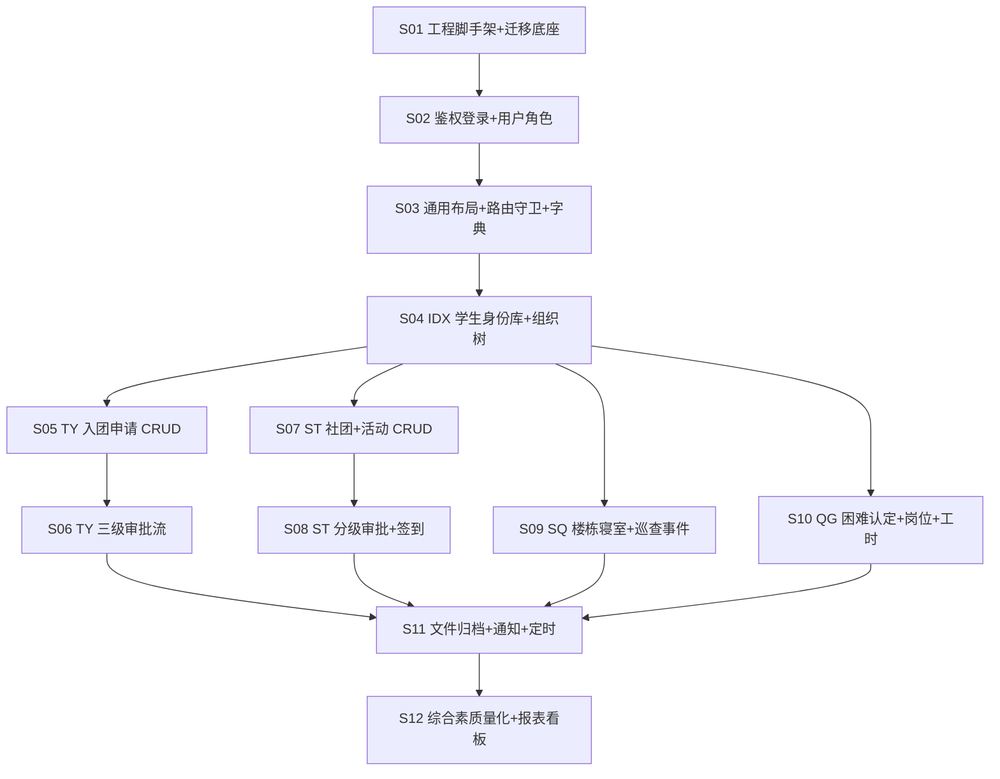

# 学生"一站式"自主管理过程管理系统 · 全栈功能垂直击穿研发路线图

| 文档版本 | 修订日期   | 编写者                  | 文档状态 |
| -------- | ---------- | ----------------------- | -------- |
| V1.0     | 2026-06-14 | 资深全栈技术负责人 (TL) | 评审稿   |

> **配套上游文档**：[01_PRD.md](./01_PRD.md) · [02_ADR.md](./02_ADR.md) · [03_database_design_spec.md](./03_database_design_spec.md) · [04_SRD_api_specifications.md](./04_SRD_api_specifications.md)
>
> **本文档目的**：将整套系统的编码实施过程，切分为 **12 个相互独立、可增量编译联调的"代码微迭代步长"**，每个步长封装为一个 **AI 执行层（Cursor / Windsurf / Trae IDE）单次任务包**，确保 Token 用量可控、上下文聚焦、产物可联调验证。
>
> **核心研发哲学**：
>
> - **垂直击穿**：每个步长打通一个端到端业务薄片（DB → Model → Service → Controller → Router → Api → View），而非"先全后端再全前端"。
> - **依赖拓扑**：严格遵循"数据底座自动迁移 → 核心通用布局 → 业务模块增删改查 → 复杂审批流流转 → 异步文件归档 → 统计报表聚合"的顺序。
> - **联调可验证**：每个步长结束时，必须能通过 Postman 或浏览器 Network 面板观察到完整 200 OK 数据流。
> - **栈一致性**：后端严格 Go + Gin + GORM + SQLite3；前端严格 Vue3 + `<script setup>` + TS + Element Plus + Pinia + Axios。

---

## 目录

- [0. 总览](#0-总览)
- [1. 步长 S01 · 工程脚手架 + 数据底座自动迁移](#1-步长-s01--工程脚手架--数据底座自动迁移)
- [2. 步长 S02 · 鉴权登录 + JWT + 用户角色基线](#2-步长-s02--鉴权登录--jwt--用户角色基线)
- [3. 步长 S03 · 核心通用布局 + 路由守卫 + 字典服务](#3-步长-s03--核心通用布局--路由守卫--字典服务)
- [4. 步长 S04 · IDX 学生身份库 + 组织树管理](#4-步长-s04--idx-学生身份库--组织树管理)
- [5. 步长 S05 · TY 团员发展 · 入团申请 CRUD](#5-步长-s05--ty-团员发展--入团申请-crud)
- [6. 步长 S06 · TY 团员发展 · 三级审批流状态机](#6-步长-s06--ty-团员发展--三级审批流状态机)
- [7. 步长 S07 · ST 社团活动 · 社团 + 活动 CRUD](#7-步长-s07--st-社团活动--社团--活动-crud)
- [8. 步长 S08 · ST 社团活动 · 分级审批 + 签到](#8-步长-s08--st-社团活动--分级审批--签到)
- [9. 步长 S09 · SQ 学生社区 · 楼栋寝室 + 巡查事件](#9-步长-s09--sq-学生社区--楼栋寝室--巡查事件)
- [10. 步长 S10 · QG 勤工助学 · 困难认定 + 岗位 + 工时](#10-步长-s10--qg-勤工助学--困难认定--岗位--工时)
- [11. 步长 S11 · 异步文件归档 + 通知中心 + 定时任务](#11-步长-s11--异步文件归档--通知中心--定时任务)
- [12. 步长 S12 · CMP 综合素质量化 + 统计报表看板](#12-步长-s12--cmp-综合素质量化--统计报表看板)
- [13. 验收与回归矩阵](#13-验收与回归矩阵)

---

## 0. 总览

### 0.1 步长依赖拓扑图



### 0.2 步长全景表

| 步长   | 名称                          | 核心交付物                       | 业务价值阀值       |
| ------ | ----------------------------- | -------------------------------- | ------------------ |
| S01    | 工程脚手架 + 数据底座         | 后端可启动、DB 自动迁移到位      | 起跑线             |
| S02    | 鉴权登录 + 用户角色           | 登录闭环、Token 颁发与刷新       | 任何业务的前置     |
| S03    | 通用布局 + 字典 + 路由守卫    | 前端骨架、动态菜单、字典下拉     | UI/UX 一致性基础   |
| S04    | IDX 学生身份库 + 组织树       | 学生主数据、院系/班级/支部 CRUD  | 4 大模块共同依赖   |
| S05    | TY 入团申请 CRUD              | 学生提交/查询/撤回入团申请       | 团员发展第 1 节点  |
| S06    | TY 三级审批流状态机           | 班级团支部→院系→校团委 审批闭环 | 团员发展核心       |
| S07    | ST 社团 + 活动 CRUD           | 社团成立、活动立项基本表单       | 社团模块基本面     |
| S08    | ST 分级审批 + 签到            | A/B/C/D 级动态链路 + 现场签到    | 社团模块核心闭环   |
| S09    | SQ 楼栋寝室 + 巡查事件        | 三级组织 + 5 级巡查 + L1-L4 事件 | 社区模块核心闭环   |
| S10    | QG 困难认定 + 岗位 + 工时     | 困难认定 → 申请 → 打卡 → 考核   | 勤工模块全链       |
| S11    | 文件归档 + 通知 + 定时任务    | 异步归档、站内信、cron 调度      | 跨模块基础设施     |
| S12    | CMP 综合素质量化 + 报表看板   | 量化分计算、Dashboard 多维图表   | 系统数据价值闭环   |

### 0.3 通用约定（所有步长强制遵循）

- **后端根包名**：`studenthub`
- **后端目录铁律**（详见 [02_ADR.md §3.1](./02_ADR.md)）：`cmd/server/main.go` + `internal/modules/{module}/{api,service,repository,model,event,statemachine}` + `pkg/*`
- **前端目录铁律**：`web/src/{api,components,layouts,modules/{module},router,stores,types,utils,views}`
- **API 前缀**：`/api/v1/{module}`
- **统一响应封包**：`{code, message, data, request_id}`
- **每个步长结束时**：`go build ./... && go test ./... && cd web && pnpm build` 全绿。

---

## 1. 步长 S01 · 工程脚手架 + 数据底座自动迁移

### 1.1 本步长研发目标

搭建后端 Go 单体项目骨架与前端 Vue3 + Vite 工程，启用 SQLite3 + GORM v2 自动迁移。完成后，运行 `go run cmd/server/main.go` 应自动创建 `data/studenthub.db` 文件，并在其中生成全部基础层表（`sys_college`、`sys_major`、`sys_class`、`sys_user`、`sys_role`、`sys_user_role`、`biz_seq`、`event_log`、`audit_log`、`file_meta`、`sys_dict`、`sys_dict_item`）。前端 `pnpm dev` 启动后访问 `http://localhost:5173` 显示一个最简首页 "StudentHub Ready"。

### 1.2 后端（Go）改造范围

**新建目录与文件**：

- `cmd/server/main.go`：启动入口，调用 `boot.Init()`。
- `internal/boot/boot.go`：装配 viper 配置、zap 日志、GORM SQLite、Gin Router、CORS、Recovery 中间件。
- `internal/boot/migrate.go`：核心函数 `func AutoMigrate(db *gorm.DB) error`，调用 `db.AutoMigrate(&model.College{}, &model.Major{}, ..., &model.EventLog{}, &model.AuditLog{}, &model.BizSeq{})`。
- `internal/modules/sys/model/college.go`、`major.go`、`class.go`、`user.go`、`role.go`、`user_role.go`、`dict.go`、`dict_item.go`：GORM 实体定义（含 `gorm:"primaryKey"`、`gorm:"uniqueIndex"`、`gorm:"index"`、`gorm:"size:64"` 等 tag），表名通过 `func (College) TableName() string { return "sys_college" }` 显式指定。
- `internal/modules/sys/model/biz_seq.go`、`internal/eventx/model/event_log.go`、`internal/auditx/model/audit_log.go`、`internal/modules/file/model/file_meta.go`。
- `internal/router/router.go`：函数签名 `func Register(r *gin.Engine, mods []Module)`；当前仅注册 `GET /healthz` 与 `GET /readyz`。
- `pkg/logger/logger.go`：`func New(env string) *zap.Logger`。
- `pkg/errs/biz_error.go`：`type BizError struct{...}` 与构造器 `New(code int, bizCode, msg string) *BizError`。
- `configs/config.yaml`：`app.port=8080`、`db.path=./data/studenthub.db`。
- `go.mod`：声明 `module studenthub`，依赖 `gin@v1.10`、`gorm.io/gorm@v1.25`、`gorm.io/driver/sqlite`、`zap`、`viper`、`uuid`。

**Router**：仅 `GET /healthz`、`GET /readyz`（返回 `{code:0, data:{db:"ok"}}`）。

### 1.3 前端（Vue3）改造范围

**新建目录与文件**：

- `web/package.json`：声明 `vue@^3.4`、`vue-router@^4`、`pinia@^2`、`element-plus@^2.7`、`axios`、`dayjs`、`vite@^5`、`typescript@^5`、`@vitejs/plugin-vue`、`unplugin-vue-components`。
- `web/vite.config.ts`：配置 `@` → `src`，开启 ElementPlusResolver 自动按需引入；代理 `/api` → `http://localhost:8080`。
- `web/src/main.ts`：挂载 App、Pinia、Router、ElementPlus 中文 locale。
- `web/src/App.vue`：`<router-view />`。
- `web/src/router/index.ts`：仅 1 条路由 `{ path:'/', component: () => import('@/views/Home.vue') }`。
- `web/src/views/Home.vue`：`<el-card><h1>StudentHub Ready</h1></el-card>`。
- `web/src/api/http.ts`：基于 axios 的 `request` 实例（baseURL=`/api/v1`、统一响应拦截、Token 头预留）。

**Element Plus 使用**：`<el-card>`、`<el-config-provider :locale="zhCn">`。

### 1.4 全栈联调与回归测试标准

| 验证项               | 操作                                                           | 期望响应                                                                     |
| -------------------- | -------------------------------------------------------------- | ---------------------------------------------------------------------------- |
| 后端启动             | `go run cmd/server/main.go`                                    | 控制台输出 `listen on :8080`，且 `data/studenthub.db` 文件已创建             |
| DB 表迁移            | 用 SQLite Browser 打开 db 文件                                 | 至少存在 `sys_college` / `sys_user` / `event_log` / `biz_seq` 等 12 张表     |
| 健康检查             | `curl http://localhost:8080/api/v1/healthz` 或 Postman         | `200 OK`，body：`{"code":0,"message":"ok","data":{"status":"healthy"},"request_id":"<ulid>"}` |
| 前端启动             | `cd web && pnpm i && pnpm dev`                                 | 控制台输出 `Local: http://localhost:5173`                                    |
| 前端页面             | 浏览器访问 `http://localhost:5173`                             | 页面渲染 `StudentHub Ready` 卡片                                              |
| Network 面板         | 刷新页面，看 `Network`                                         | `/api/v1/healthz` 由 vite 代理转发，状态 200                                  |

---

## 2. 步长 S02 · 鉴权登录 + JWT + 用户角色基线

### 2.1 本步长研发目标

实现登录闭环：用户在前端登录页输入工号/学号 + 密码，后端 `POST /api/v1/auth/login` 校验 `sys_user.password_hash`（bcrypt），签发 `access_token`（15min）+ `refresh_token`（HttpOnly Cookie，7d）。前端将 `access_token` 存入 Pinia `useAuthStore`，axios 自动注入 `Authorization: Bearer xxx`，401 时透明刷新。完成后访问 `/dashboard` 必须先登录。

### 2.1.1 子切片 S02a · RT 黑名单 + 改密吊销（2026-06-23 补齐）

按 ADR-005 "决策细化" 落地：
- `sys_user.token_version` 字段（INT, default 0）；
- `pkg/revokex` 进程内 LRU（jti → 过期时间），`auth_service` / `auth_handler` / `auth_middleware` 全部接入；
- `POST /auth/password` 接口上线（改密 → token_version+1 → 旧 RT 全部失效）；
- `POST /auth/logout` 把当前 RT jti 进黑名单；
- 前端 40103 单独走"直接登出"分支，不触发 refresh 重试。

> 本子切片仍属 S02，**不**单开 S0X；垂直击穿：`docs(03/04/02/05) → Model → Repo → revokex → Service → API → middleware → 前端 → 回归`。

### 2.2 后端（Go）改造范围

**新建/修改**：

- `internal/modules/sys/model/user.go`：补字段 `PasswordHash string`、`Status string`（active/disabled）、`StudentID *int64`。
- `internal/modules/auth/api/auth_handler.go`：核心函数：
  - `func (h *AuthHandler) Login(c *gin.Context)` → `POST /api/v1/auth/login`，body `{login, password}`。
  - `func (h *AuthHandler) Refresh(c *gin.Context)` → `POST /api/v1/auth/refresh`。
  - `func (h *AuthHandler) Logout(c *gin.Context)` → `POST /api/v1/auth/logout`。
  - `func (h *AuthHandler) Me(c *gin.Context)` → `GET /api/v1/auth/me`。
- `internal/modules/auth/service/auth_service.go`：`Login(ctx, dto) (*TokenPair, *UserView, error)`、`Refresh(ctx, refreshToken) (*TokenPair, error)`。
- `internal/modules/auth/service/jwt.go`：`GenerateAccess(uid int64, roles []string) (string, error)`、`ParseAccess(token string) (*Claims, error)`。
- `internal/middleware/auth_middleware.go`：`func JWTAuth() gin.HandlerFunc`，从 `Authorization` 头解析并塞入 `c.Set("user", claims)`。
- `internal/middleware/rbac_middleware.go`：`func RequireRoles(roles ...string) gin.HandlerFunc`（暂占位，详细策略 S03 完成）。
- `internal/boot/seed.go`：`func SeedAdmin(db *gorm.DB)` 启动时若无任何用户则创建 `admin/admin@123`，并赋角色 `R-SY-ADMIN`。

### 2.3 前端（Vue3）改造范围

**新建/修改**：

- `web/src/views/auth/Login.vue`：使用 `<el-form>` + `<el-input>` + `<el-button>` 实现登录表单，提交后调用 `useAuthApi().login()`。
- `web/src/api/auth.ts`：导出 `login(data)`、`refresh()`、`logout()`、`me()`。
- `web/src/stores/auth.ts`：Pinia store，state `accessToken / userInfo / roles`，actions `login / logout / refreshToken / fetchMe`，存储到 `localStorage`。
- `web/src/api/http.ts`：增加请求拦截注入 `Authorization`、响应拦截识别 401 自动 refresh 并重试。
- `web/src/router/index.ts`：新增 `/login` 路由；新增 `beforeEach` 守卫：未登录 → 跳 `/login`，已登录访问 `/login` → 跳 `/dashboard`。
- `web/src/views/Dashboard.vue`：登录后默认页面，渲染欢迎语 + 角色列表。

**Element Plus**：`<el-form>`、`<el-form-item>`、`<el-input type="password" show-password>`、`<el-button type="primary">`、`ElMessage`。

### 2.4 全栈联调与回归测试标准

| 验证项     | 操作                                                                                   | 期望响应                                                                                                                              |
| ---------- | -------------------------------------------------------------------------------------- | ------------------------------------------------------------------------------------------------------------------------------------- |
| 登录成功   | Postman: `POST /api/v1/auth/login` body `{"login":"admin","password":"admin@123"}`      | `200 OK` + `{"code":0,"data":{"access_token":"eyJhbGciOi...","token_type":"Bearer","expires_in":900,"user":{"id":1,"name":"admin","roles":["R-SY-ADMIN"]}},"request_id":"..."}` |
| 登录失败   | 同上但密码错                                                                            | `200 OK` + `{"code":1001,"message":"账号或密码错误",...}` 或 HTTP 401                                                                  |
| 受保护接口 | 携带正确 Bearer 调用 `GET /api/v1/auth/me`                                              | `200 OK` + `{"code":0,"data":{"id":1,"name":"admin","roles":["R-SY-ADMIN"]}}`                                                          |
| 未授权访问 | 不带 Token 调用 `GET /api/v1/auth/me`                                                   | `401` + `{"code":1003,"message":"未登录"}`                                                                                              |
| 浏览器联调 | 输入 admin/admin@123 → 提交                                                            | Network 面板可见 `/auth/login` 200，跳转 `/dashboard`，刷新页面后仍在 `/dashboard`                                                      |

---

## 3. 步长 S03 · 核心通用布局 + 路由守卫 + 字典服务

### 3.1 本步长研发目标

构建 SaaS 标配的"侧边栏 + 顶部 + 主区域"三段布局；后端字典服务供下拉选择项使用（性别、政治面貌、活动类型、岗位类型 等）；接入 Casbin 完成 RBAC + ABAC 校验；前端实现按角色动态菜单生成。完成后管理员登录看到全模块菜单，普通学生只看到"我的申请"。

### 3.2 后端（Go）改造范围

**新建/修改**：

- `internal/modules/sys/api/dict_handler.go`：
  - `GET /api/v1/sys/dicts/{code}/items` → `func (h *DictHandler) ListItems(c *gin.Context)`，返回 `[{code,label,sort}]`。
  - `GET /api/v1/sys/dicts` 列表、`POST /api/v1/sys/dicts/items` 增、`PUT /api/v1/sys/dicts/items/{id}` 改、`DELETE` 删（仅 R-SY-ADMIN）。
- `internal/modules/sys/api/menu_handler.go`：`GET /api/v1/sys/menus/mine`（返回当前用户可见菜单树）。
- `internal/accessx/casbin.go`：`func New(db *gorm.DB) (*casbin.Enforcer, error)`，加载策略 `configs/policies/rbac_model.conf` + `policy.csv`。
- `internal/middleware/rbac_middleware.go`：升级为 `func Authorize(resource, action string) gin.HandlerFunc`，校验 `enforcer.Enforce(role, resource, action)`。
- `internal/boot/seed.go`：补充字典种子（性别、政治面貌、活动等级 A/B/C/D、岗位类型 等），并播种菜单 `sys_menu` 表。
- `internal/cachex/lru.go`：进程内 LRU，缓存字典与菜单（5 min TTL），写操作时 `Invalidate`。

### 3.3 前端（Vue3）改造范围

**新建/修改**：

- `web/src/layouts/DefaultLayout.vue`：左侧 `<el-menu>` 侧边栏 + 顶部 `<el-header>`（含面包屑 + 用户头像下拉）+ 主区 `<router-view>`。使用 `<el-container>`/`<el-aside>`/`<el-main>` 经典布局。
- `web/src/api/sys.ts`：`getMyMenus()`、`getDictItems(code)`、CRUD 字典 API。
- `web/src/stores/menu.ts`：Pinia store，登录后 `fetchMenus()` 拉取菜单树并动态注册路由（`router.addRoute`）。
- `web/src/stores/dict.ts`：缓存常用字典，提供 `useDict('GENDER')` 组合式函数返回 ref。
- `web/src/components/DictSelect.vue`：基于字典码自动填充选项的 `<el-select>` 通用包装。
- `web/src/views/sys/DictManage.vue`：字典管理页（仅 admin 可见），使用 `<el-table>` + `<el-dialog>` + `<el-form>` 完成 CRUD。
- `web/src/router/index.ts`：分静态路由（`/login`、`/dashboard`、`/403`、`/404`）与动态路由；守卫升级为 `菜单未加载 → 拉取 → 注册 → next()`。

**Element Plus**：`<el-menu>`、`<el-sub-menu>`、`<el-menu-item>`、`<el-breadcrumb>`、`<el-dropdown>`、`<el-table>`、`<el-dialog>`、`<el-form>`、`<el-select>`、`<el-pagination>`。

### 3.4 全栈联调与回归测试标准

| 验证项       | 操作                                                       | 期望响应                                                                                                                                |
| ------------ | ---------------------------------------------------------- | --------------------------------------------------------------------------------------------------------------------------------------- |
| 字典查询     | `GET /api/v1/sys/dicts/GENDER/items`                       | `{"code":0,"data":{"items":[{"code":"M","label":"男","sort":1},{"code":"F","label":"女","sort":2}]}}`                                   |
| 我的菜单     | admin 登录后 `GET /api/v1/sys/menus/mine`                  | `{"code":0,"data":{"menus":[{"code":"ty","title":"团员发展","children":[...]},{"code":"st",...},...]}}`                                |
| 学生菜单     | 学生用户 (R-STU-NORM) 登录后同上                            | `data.menus` 仅包含 `dashboard` + `mine`（不含管理类）                                                                                  |
| 越权访问     | 学生用户调用 `GET /api/v1/sys/dicts`（管理）                | `403` + `{"code":1004,"message":"无权限"}`                                                                                              |
| 浏览器联调   | admin 登录 → 看到完整左侧菜单 → 点击"字典管理"               | 路由切换 `/sys/dicts`，表格渲染数据；新增字典项后 `<el-message>` 提示成功，列表自动刷新                                                  |

---

## 4. 步长 S04 · IDX 学生身份库 + 组织树管理

### 4.1 本步长研发目标

打通学生主数据：管理员可以在"组织管理"维护院系/专业/班级树，并批量录入或单个新增学生（含基本信息 + 家庭信息加密字段）；学生登录后能在"我的档案"看到自己的画像。本步长是 4 大业务模块共同依赖的"学生主体"。

### 4.2 后端（Go）改造范围

**新建/修改**：

- `internal/modules/idx/model/student.go`：实体含 `student_no`（学号 unique）、`name`、`gender`、`college_id`、`major_id`、`class_id`、`enroll_year`、`status`（在读/休学/毕业），加密字段 `id_card_no_enc`、`phone_enc`（详见 ADR-011）。
- `internal/modules/idx/api/student_handler.go`：
  - `GET /api/v1/idx/students` 分页列表（支持 `?college_id=&keyword=`）→ `func (h *StudentHandler) List`。
  - `GET /api/v1/idx/students/{id}` → `Get`。
  - `POST /api/v1/idx/students` → `Create`。
  - `PUT /api/v1/idx/students/{id}` → `Update`。
  - `DELETE /api/v1/idx/students/{id}` → `SoftDelete`。
  - `POST /api/v1/idx/students/import` → `BatchImport`（接收 CSV）。
- `internal/modules/idx/api/profile_handler.go`：`GET /api/v1/idx/profile/me` 返回学生本人画像（与 sys_user 关联）。
- `internal/modules/sys/api/org_handler.go`：院系/专业/班级 CRUD：
  - `GET/POST/PUT/DELETE /api/v1/sys/colleges`
  - `GET/POST/PUT/DELETE /api/v1/sys/majors`
  - `GET/POST/PUT/DELETE /api/v1/sys/classes`
- `internal/modules/idx/repository/student_repository.go`：实现自动 GORM Preload `College / Major / Class`。
- `pkg/cryptox/aes.go`：`Encrypt(plain string) string`、`Decrypt(cipher string) (string, error)`，统一加解密身份证、手机号。

### 4.3 前端（Vue3）改造范围

**新建/修改**：

- `web/src/modules/idx/views/StudentList.vue`：左侧 `<el-tree>` 组织树（院系→专业→班级），右侧 `<el-table>` 学生列表 + `<el-pagination>`。
- `web/src/modules/idx/views/StudentForm.vue`：`<el-dialog>` + `<el-form>`，新建/编辑学生。
- `web/src/modules/idx/views/StudentImport.vue`：使用 `<el-upload>` 上传 CSV，调用导入 API。
- `web/src/modules/idx/views/MyProfile.vue`：学生本人画像页（`<el-descriptions>` 渲染只读信息）。
- `web/src/modules/sys/views/OrgManage.vue`：院系/专业/班级 CRUD 管理页（`<el-tree>` + 节点级操作）。
- `web/src/api/idx.ts`、`web/src/api/sys-org.ts`。
- `web/src/types/idx.ts`：`Student`、`College`、`Major`、`Class` 类型定义。

**Element Plus**：`<el-tree>`、`<el-table>`、`<el-pagination>`、`<el-dialog>`、`<el-form>`、`<el-upload>`、`<el-descriptions>`、`<el-tag>`。

### 4.4 全栈联调与回归测试标准

| 验证项       | 操作                                                                                                                | 期望响应                                                                                                                                                                                                |
| ------------ | ------------------------------------------------------------------------------------------------------------------- | ------------------------------------------------------------------------------------------------------------------------------------------------------------------------------------------------------- |
| 院系列表     | admin: `GET /api/v1/sys/colleges`                                                                                   | `{"code":0,"data":{"items":[{"id":1,"code":"CS","name":"计算机学院"}],"total":1}}`                                                                                                                       |
| 创建学生     | admin: `POST /api/v1/idx/students` body `{"student_no":"20231001","name":"张三","gender":"M","class_id":1,...}`     | `{"code":0,"data":{"id":1,"student_no":"20231001","name":"张三",...}}` 且 `id_card_no` 在 DB 内为密文                                                                                                   |
| 学生列表脱敏 | admin: `GET /api/v1/idx/students?keyword=张三`                                                                      | `data.items[0].id_card_no` 显示 `110***********0023`（脱敏）                                                                                                                                            |
| 我的画像     | 学生身份登录后 `GET /api/v1/idx/profile/me`                                                                         | `{"code":0,"data":{"student_no":"20231001","name":"张三","class":{"name":"CS2301"}}}`                                                                                                                  |
| 浏览器联调   | admin → 组织管理 → 新增院系 "信息工程学院" → 新增专业 "软件工程" → 新增班级 "SE2301" → 学生管理 → 新增学生         | 各操作均看到 `<el-message-success>`，刷新后数据持久化；学生用户登录后"我的档案"页正确渲染数据                                                                                                            |

---

## 5. 步长 S05 · TY 团员发展 · 入团申请 CRUD

### 5.1 本步长研发目标

实现入团申请单的"提交/草稿/查询/撤回"基本能力。学生填写申请书 → 提交 → 状态自动 S0(草稿) / S1(待审)；班主任/管理员可在列表中查看，但暂不进入审批流（S06 完成）。本步长落地业务编号生成器、字数校验、年龄校验等硬规则。

### 5.2 后端（Go）改造范围

**新建/修改**：

- `internal/modules/ty/model/application.go`：`ty_application` 实体，字段含 `biz_no`、`student_id`、`apply_date`、`self_statement`（≥500 字）、`status`（S0-S4）、`college_id`。
- `internal/idgen/biz_no.go`：`func NextBizNo(ctx, db, module string) (string, error)`，事务原子操作 `biz_seq` 表。
- `internal/modules/ty/api/application_handler.go`：
  - `GET /api/v1/ty/applications` → `List`（支持过滤 `?status=&student_id=&college_id=`）。
  - `GET /api/v1/ty/applications/{id}` → `Get`。
  - `POST /api/v1/ty/applications` → `Create`（保存为 S0 草稿）。
  - `PUT /api/v1/ty/applications/{id}` → `Update`（仅 S0 状态可改）。
  - `POST /api/v1/ty/applications/{id}/submit` → `Submit`（S0 → S1）。
  - `POST /api/v1/ty/applications/{id}/withdraw` → `Withdraw`（S1 → S0）。
  - `DELETE /api/v1/ty/applications/{id}` → 软删（仅 S0/S4）。
- `internal/modules/ty/service/application_service.go`：核心函数：
  - `Create(ctx, dto) (*Application, error)`：校验年龄 14-28、自述 ≥500 字、同期无 S1。
  - `Submit(ctx, id) error`、`Withdraw(ctx, id, reason) error`、`Update(...)`、`List(...)`、`Get(...)`。

### 5.3 前端（Vue3）改造范围

**新建/修改**：

- `web/src/modules/ty/views/ApplicationList.vue`：列表页，按角色显示数据（学生只看自己的，管理员看全部）。
- `web/src/modules/ty/views/ApplicationForm.vue`：申请单表单页，使用 `<el-form>` + `<el-input type="textarea" :rows="10">` + `<el-date-picker>` + `<el-tag>` 显示状态。
- `web/src/modules/ty/views/ApplicationDetail.vue`：详情页，含"提交"/"撤回"操作按钮。
- `web/src/api/ty.ts`：导出 `listApplications / getApplication / createApplication / updateApplication / submitApplication / withdrawApplication / deleteApplication`。
- `web/src/types/ty.ts`：`Application`、`ApplicationStatus` 等类型。

**Element Plus**：`<el-table>`、`<el-form>`、`<el-input type="textarea">`、`<el-date-picker>`、`<el-tag>`、`<el-button>`、`<el-popconfirm>`、`<el-message-box>`。

### 5.4 全栈联调与回归测试标准

| 验证项       | 操作                                                                                                                       | 期望响应                                                                                                                                                                                       |
| ------------ | -------------------------------------------------------------------------------------------------------------------------- | ---------------------------------------------------------------------------------------------------------------------------------------------------------------------------------------------- |
| 创建草稿     | 学生: `POST /api/v1/ty/applications` body `{"apply_date":"2026-06-14","self_statement":"...500 字..."}`                    | `{"code":0,"data":{"id":1,"biz_no":"TY-2026-0001","status":"S0","student_id":10,"apply_date":"2026-06-14T00:00:00+08:00"}}`                                                                  |
| 自述字数不足 | 同上但 `self_statement` 仅 100 字                                                                                          | `{"code":2401,"message":"思想政治表现自述字数须 ≥ 500"}`                                                                                                                                       |
| 年龄超限     | 出生于 1990 年的学生提交                                                                                                    | `{"code":2402,"message":"申请人年龄超出 14-28 周岁范围"}`                                                                                                                                      |
| 提交申请     | `POST /api/v1/ty/applications/1/submit`                                                                                    | `{"code":0,"data":{"id":1,"status":"S1"}}`                                                                                                                                                     |
| 重复提交     | 已有 S1 申请的学生再次提交                                                                                                  | `{"code":2403,"message":"已存在审批中申请，请勿重复提交"}`                                                                                                                                     |
| 浏览器联调   | 学生登录 → 团员发展 → 我的申请 → 新增 → 填写表单 → 保存 → 提交                                                              | Network 面板看到 `POST /applications` 200 → `POST /1/submit` 200，列表中状态从 `<el-tag>草稿</el-tag>` 变为 `<el-tag type="warning">待审</el-tag>`                                              |

---

## 6. 步长 S06 · TY 团员发展 · 三级审批流状态机

### 6.1 本步长研发目标

引入轻量自研状态机（[ADR-007](./02_ADR.md)），打通"班级团支部初审 → 院系团委复核 → 校团委终审"三级链路；通过/驳回/撤回均落 `event_log`；前端展示审批轨迹（`<el-timeline>`）。本步长是审批流的范本，后续 S08（社团活动）和 S10（勤工解聘）将复用此状态机引擎。

### 6.2 后端（Go）改造范围

**新建/修改**：

- `internal/statem/state_machine.go`：通用状态机引擎，`type Transition`、`type Engine`，函数 `Apply(ctx, biz, action, payload) error`。
- `internal/modules/ty/statemachine/application_sm.go`：定义申请单状态转移表（S1→S2 班级初审 / S2→S2 院系复核 / S2→S3 校级终审 / S* → S4 驳回 / S2→S1 撤回）。
- `internal/modules/ty/model/approval_record.go`：`ty_approval_record` 表（application_id、approver_id、approver_role、action、result、opinion、occurred_at）。
- `internal/modules/ty/api/application_handler.go`：新增端点：
  - `POST /api/v1/ty/applications/{id}/approve` body `{action:"college_initial|college_review|league_final", result:"approve|reject", opinion:"..."}`。
  - `GET /api/v1/ty/applications/{id}/approvals` → 审批记录列表。
- `internal/modules/ty/service/application_service.go`：补 `Approve(ctx, id, dto) error`，调用 `statem.Apply()`，并发布事件 `TyApplicationApproved` 到 `eventx`。
- `internal/eventx/bus.go`：`Publish(ctx, event)`、`Subscribe(eventType, handler)`，写 `event_log`。
- `internal/auditx/middleware.go`：审批类 API 全量留痕，写 `audit_log`。

### 6.3 前端（Vue3）改造范围

**新建/修改**：

- `web/src/modules/ty/views/ApprovalCenter.vue`：审批人工作台（"待我审批" Tab + 历史 Tab），使用 `<el-tabs>` + `<el-table>`。
- `web/src/modules/ty/components/ApprovalDialog.vue`：审批对话框，`<el-radio-group>` 选择通过/驳回 + `<el-input type="textarea">` 输入意见。
- `web/src/modules/ty/components/ApprovalTimeline.vue`：使用 `<el-timeline>` + `<el-timeline-item>` 渲染审批轨迹（含审批人 / 时间 / 角色 / 意见）。
- `web/src/modules/ty/views/ApplicationDetail.vue`：嵌入 `ApprovalTimeline`，按钮按角色展示"班级初审/院系复核/校级终审"。
- `web/src/api/ty.ts`：补 `approveApplication(id, dto)`、`getApplicationApprovals(id)`。

**Element Plus**：`<el-tabs>`、`<el-timeline>`、`<el-radio-group>`、`<el-message-box>`（确认审批）、`<el-tag>`（结果）、`<el-empty>`（无待办）。

### 6.4 全栈联调与回归测试标准

| 验证项         | 操作                                                                                                              | 期望响应                                                                                                                                                                                |
| -------------- | ----------------------------------------------------------------------------------------------------------------- | --------------------------------------------------------------------------------------------------------------------------------------------------------------------------------------- |
| 班级初审通过   | R-STU-LEAGUE 用户: `POST /api/v1/ty/applications/1/approve` body `{"action":"college_initial","result":"approve","opinion":"思想积极，同意推荐"}` | `{"code":0,"data":{"status":"S2","next_step":"college_review"}}`                                                                                                                          |
| 越权审批       | R-COL-COUN 调 `league_final`                                                                                      | `{"code":1004,"message":"无该步骤审批权限"}`                                                                                                                                            |
| 校级终审驳回   | R-SY-LEAGUE: `POST .../approve` `{"action":"league_final","result":"reject","opinion":"材料不齐"}`                | `{"code":0,"data":{"status":"S4","reject_reason":"材料不齐"}}`                                                                                                                          |
| 审批轨迹       | `GET /api/v1/ty/applications/1/approvals`                                                                         | `{"code":0,"data":{"records":[{"step":"college_initial","approver":"班主任王老师","result":"approve","opinion":"...","occurred_at":"2026-06-14T10:00:00+08:00"},{...},{...}]}}`         |
| event_log 落库 | DB 直查 `event_log` 表                                                                                            | 至少 3 条 `event_type=TyApplicationApproved` 记录，含 `prev_hash` 与 `hash` 链式字段                                                                                                    |
| 浏览器联调     | 校团委账号登录 → 团员发展 → 审批中心 → 看到 1 条待办 → 点击"通过" → 输意见 → 提交                                | `<el-message-success>`，记录从待办移除；学生端查看详情 → 状态变 `<el-tag type="success">通过</el-tag>`，时间线展示 3 个节点                                                                |

---

## 7. 步长 S07 · ST 社团活动 · 社团 + 活动 CRUD

### 7.1 本步长研发目标

实现社团主数据 + 活动立项的基础 CRUD（不含审批流）。社长能新建社团（草稿态）、补充章程；可以发起活动立项（草稿）；管理员可看到全校社团列表和活动列表；学生可浏览公开社团。

### 7.2 后端（Go）改造范围

**新建/修改**：

- `internal/modules/st/model/association.go`：`st_association`，字段 `biz_no`、`name`、`college_id`、`tutor_id`、`leader_student_id`、`status`（筹备/试运行/注册成立/评估整顿/注销）、`charter_file_id`。
- `internal/modules/st/model/activity.go`：`st_activity`，字段 `biz_no`、`association_id`、`name`、`level`（A/B/C/D）、`start_at`、`end_at`、`location`、`expected_count`、`budget_cents`、`plan_text`、`status`（S0-S4）。
- `internal/modules/st/model/assoc_member.go`：`st_assoc_member`，字段 `association_id`、`student_id`、`role`（president/vice/director/member）、`joined_at`、`left_at`。
- `internal/modules/st/api/association_handler.go`：CRUD 端点（`GET / POST / PUT / DELETE /api/v1/st/associations`、`/{id}/members`）。
- `internal/modules/st/api/activity_handler.go`：CRUD 端点（`GET / POST / PUT / DELETE /api/v1/st/activities`、`POST /{id}/submit`）。
- `internal/modules/st/service/{association,activity}_service.go`：
  - `Create(ctx, dto)`：校验同名、发起人 5-20 人、章程文件等。
  - `LevelAutoDetect(activity) string`：根据预算 + 跨校规模自动判定 A/B/C/D。

### 7.3 前端（Vue3）改造范围

**新建/修改**：

- `web/src/modules/st/views/AssociationList.vue`：社团列表，使用 `<el-table>` + 分类筛选 `<el-radio-group>`（全部/我管理的/我加入的）。
- `web/src/modules/st/views/AssociationForm.vue`：社团申请表（`<el-form>` + `<el-input>` + `<el-select>` 指导教师 + `<el-upload>` 章程附件 + `<el-input-number>` 发起人数量）。
- `web/src/modules/st/views/AssociationDetail.vue`：含 Tab：基本信息 / 成员 / 活动。
- `web/src/modules/st/views/ActivityList.vue`、`ActivityForm.vue`、`ActivityDetail.vue`：活动列表/编辑/详情。
- `web/src/modules/st/components/LevelTag.vue`：根据 A/B/C/D 显示不同颜色 `<el-tag>`。
- `web/src/api/st.ts`、`web/src/types/st.ts`。

**Element Plus**：`<el-tabs>`、`<el-table>`、`<el-form>`、`<el-input-number>`、`<el-upload>`、`<el-radio-group>`、`<el-tag>`、`<el-date-picker type="datetimerange">`。

### 7.4 全栈联调与回归测试标准

| 验证项       | 操作                                                                                                                  | 期望响应                                                                                                                                                                                  |
| ------------ | --------------------------------------------------------------------------------------------------------------------- | ----------------------------------------------------------------------------------------------------------------------------------------------------------------------------------------- |
| 创建社团     | 学生: `POST /api/v1/st/associations` body `{"name":"动漫社","college_id":1,"tutor_id":2,"founders":[5,6,7,8,9]}`     | `{"code":0,"data":{"id":1,"biz_no":"ST-2026-0001","status":"prepare","name":"动漫社"}}`                                                                                                  |
| 发起人不足   | 同上但 `founders` 仅 3 人                                                                                              | `{"code":3401,"message":"发起人须 5-20 名"}`                                                                                                                                              |
| 创建活动     | 社长: `POST /api/v1/st/activities` body `{"association_id":1,"name":"漫展","start_at":"2026-09-01T13:00:00+08:00","end_at":"2026-09-01T17:00:00+08:00","expected_count":300,"budget_cents":600000}` | `{"code":0,"data":{"id":1,"biz_no":"ST-2026-0001","level":"B","status":"S0"}}` |
| 浏览器联调   | 学生 → 社团活动 → 我的社团 → 新增 → 上传章程 PDF → 保存草稿 → 编辑 → 提交                                            | 表格刷新看到新记录；状态 `<el-tag>筹备中</el-tag>`；活动列表中按 A/B/C/D 染色显示等级                                                                                                                                                                                          |

---

## 8. 步长 S08 · ST 社团活动 · 分级审批 + 签到

### 8.1 本步长研发目标

落地活动立项的"分级动态审批链"（A 级 5 节点 / B 级 4 节点 / C 级 2 节点 / D 级 1 节点），复用 S06 的状态机引擎；现场签到通过扫码或 GPS 完成；活动结束后社长可提交活动总结。

### 8.2 后端（Go）改造范围

- `internal/modules/st/statemachine/activity_sm.go`：基于活动 `level` 动态生成审批转移表。
- `internal/modules/st/api/activity_handler.go` 新增：
  - `POST /api/v1/st/activities/{id}/approve` body `{step, result, opinion}`。
  - `POST /api/v1/st/activities/{id}/checkin` body `{student_id, lat, lng, method:"qr|gps"}`。
  - `POST /api/v1/st/activities/{id}/summary` body `{participants, photos:[file_ids], goal_score, improvements}`。
  - `GET /api/v1/st/activities/{id}/checkins` 列表。
- `internal/modules/st/model/activity_checkin.go`、`activity_summary.go`、`activity_approval.go`。
- `internal/modules/st/service/checkin_service.go`：校验签到时间窗（开始前 30 min ~ 开始后 15 min）、迟到判定、GPS 距离阈值。

### 8.3 前端（Vue3）改造范围

- `web/src/modules/st/views/ActivityApproval.vue`：审批工作台，复用 `ApprovalDialog` 组件。
- `web/src/modules/st/views/ActivityCheckin.vue`：扫码/GPS 签到页（手机 H5），使用 `<el-button size="large">` + `navigator.geolocation`。
- `web/src/modules/st/views/ActivitySummary.vue`：总结提交页，使用 `<el-upload list-type="picture-card">` 上传现场照。
- `web/src/modules/st/components/CheckinTable.vue`：签到记录表（含迟到分钟数 / 签到方式）。

**Element Plus**：`<el-upload list-type="picture-card">`、`<el-rate>`（目标达成度）、`<el-statistic>`（总参与人数）、`<el-result>`（签到成功页）。

### 8.4 全栈联调与回归测试标准

| 验证项     | 操作                                                                                          | 期望响应                                                                                                                                                              |
| ---------- | --------------------------------------------------------------------------------------------- | --------------------------------------------------------------------------------------------------------------------------------------------------------------------- |
| B 级活动审批 | 指导教师 → 院系 → 校社联 → 校团委 4 节点依次 approve                                          | 最终 `{"code":0,"data":{"status":"S3","level":"B","approval_chain_completed":true}}`                                                                                  |
| 签到成功   | 学生: `POST /api/v1/st/activities/1/checkin` body `{"method":"qr","lat":30.5,"lng":114.3}`    | `{"code":0,"data":{"id":1,"checkin_at":"2026-09-01T13:05:00+08:00","is_late":false,"late_minutes":0}}`                                                              |
| 超时签到   | 活动开始 30 分钟后签到                                                                         | `{"code":0,"data":{"is_late":true,"late_minutes":30,"counted_as_absent":true}}`                                                                                       |
| 提交总结   | `POST /api/v1/st/activities/1/summary` body `{"participants":280,"photos":[10,11,12],"goal_score":4}` | `{"code":0,"data":{"id":1,"submitted_at":"2026-09-04T10:00:00+08:00"}}`                                                                                              |
| 浏览器联调 | 社长 → 立项 → 提交 → 各级审批 → 现场签到 → 提交总结                                           | 整个流程 Network 全 200；活动详情页时间线展示 4 节点全绿；签到记录表分页加载，迟到行 `<el-tag type="danger">`                                                            |

---

## 9. 步长 S09 · SQ 学生社区 · 楼栋寝室 + 巡查事件

### 9.1 本步长研发目标

构建"楼栋 → 楼层 → 寝室"三级组织字典；落地 5 类巡查（卫生 / 晚归 / 违规电器 / 安全隐患 / 消防通道）；落地 L1-L4 异常事件分级上报与处置；楼层长可在移动端快速录入巡查与事件。

### 9.2 后端（Go）改造范围

- `internal/modules/sq/model/{building,room,room_member,inspection,incident,inc_attach,selfgov_position}.go`：6 张实体表。
- `internal/modules/sq/api/building_handler.go`：楼栋 / 楼层 / 寝室 CRUD，端点 `/api/v1/sq/buildings`、`/api/v1/sq/rooms`、`/api/v1/sq/rooms/{id}/members`。
- `internal/modules/sq/api/inspection_handler.go`：
  - `POST /api/v1/sq/inspections`、`GET /api/v1/sq/inspections`。
  - 字段含 `inspection_type`（cleanliness/late_return/illegal_appliance/safety/fire_passage）、`scope_id`、`score`、`deductions[]`、`photos[]`。
- `internal/modules/sq/api/incident_handler.go`：
  - `POST /api/v1/sq/incidents` 上报，必填 `level`(L1-L4)、`occurred_at`、`location`、`parties`、`description`。
  - `POST /api/v1/sq/incidents/{id}/handle` 处置回填。
  - `POST /api/v1/sq/incidents/{id}/close` 结案（L4 须 R-COL-COUN 以上）。
- `internal/modules/sq/service/incident_service.go`：L4 级触发"应急通知"事件 `SqIncidentL4Raised` 发布到 eventx，由 S11 接管多通道通知。

### 9.3 前端（Vue3）改造范围

- `web/src/modules/sq/views/BuildingTree.vue`：左 `<el-tree>` 楼栋 → 楼层 → 寝室 → 学生；右侧抽屉显示选中节点详情。
- `web/src/modules/sq/views/InspectionList.vue` + `InspectionForm.vue`：巡查录入表单（按类型动态切换字段，使用 `<el-segmented>` 选择类型）。
- `web/src/modules/sq/views/IncidentList.vue` + `IncidentReport.vue`：事件列表 + 上报表单（移动端友好），等级用 `<el-tag :type="L1-L4">` 高亮。
- `web/src/modules/sq/views/IncidentDetail.vue`：详情页含处置时间线 + 附件画廊。
- `web/src/modules/sq/components/LevelBadge.vue`：L1 灰 / L2 黄 / L3 橙 / L4 红。

**Element Plus**：`<el-tree>`、`<el-drawer>`、`<el-segmented>`、`<el-upload>`、`<el-image-viewer>`、`<el-alert :type="error">`（L4 警示条）、`<el-skeleton>`。

### 9.4 全栈联调与回归测试标准

| 验证项       | 操作                                                                                                                                                              | 期望响应                                                                                                                                                                          |
| ------------ | ----------------------------------------------------------------------------------------------------------------------------------------------------------------- | --------------------------------------------------------------------------------------------------------------------------------------------------------------------------------- |
| 创建寝室     | admin: `POST /api/v1/sq/rooms` body `{"building_id":1,"floor":3,"room_no":"301","capacity":4}`                                                                  | `{"code":0,"data":{"id":1,"building_id":1,"floor":3,"room_no":"301"}}`                                                                                                            |
| 录入巡查     | 楼层长: `POST /api/v1/sq/inspections` body `{"inspection_type":"cleanliness","room_id":1,"score":85,"deductions":["未叠被"]}`                                    | `{"code":0,"data":{"id":1,"biz_no":"SQ-2026-0001","score":85,"created_at":"..."}}`                                                                                              |
| 上报 L3 事件 | `POST /api/v1/sq/incidents` body `{"level":"L3","occurred_at":"2026-06-14T22:00:00+08:00","location":"3 栋 301","parties":[10,11],"description":"打架"}`        | `{"code":0,"data":{"id":1,"biz_no":"SQ-2026-0002","level":"L3","status":"reported"}}`                                                                                            |
| L4 通知触发  | 上报 L4 事件                                                                                                                                                       | event_log 表立即多 1 条 `SqIncidentL4Raised`；S11 集成后 notification 表多 N 条接收人记录                                                                                          |
| 浏览器联调   | 楼层长 H5 登录 → 巡查录入（拍照上传）→ 提交 → 切到事件页 → 上报 → 看到红色横幅 → 楼栋管理员看到通知                                                                | 表单提交成功 `<el-result icon="success">`；事件列表按等级筛选；详情页画廊查看附件                                                                                                |

---

## 10. 步长 S10 · QG 勤工助学 · 困难认定 + 岗位 + 工时

### 10.1 本步长研发目标

落地"困难认定 → 岗位发布 → 学生申请 → 录用 → 工时打卡 → 月度考核"完整链路。重点是"硬规则"系统化：每月 ≤ 40h、每周 ≤ 20h、每天 ≤ 8h、月度考核 < 60 分仅发 50%。

### 10.2 后端（Go）改造范围

- `internal/modules/qg/model/{difficulty_cert,position,position_apply,attendance,monthly_assess,payroll,renewal_term}.go`：7 张实体表。
- `internal/modules/qg/api/difficulty_handler.go`：困难认定 CRUD + 班级评议 + 院系初审 + 学生处终审动作端点。
- `internal/modules/qg/api/position_handler.go`：
  - `GET / POST / PUT / DELETE /api/v1/qg/positions`（含审批 `POST /{id}/submit`、`POST /{id}/approve`）。
  - `GET /api/v1/qg/positions/{id}/applies` 申请列表。
- `internal/modules/qg/api/attendance_handler.go`：
  - `POST /api/v1/qg/attendance/clock-in` body `{position_id, lat, lng}`。
  - `POST /api/v1/qg/attendance/clock-out`。
  - `POST /api/v1/qg/attendance/{id}/makeup` 补卡申请。
- `internal/modules/qg/api/assessment_handler.go`：`POST /api/v1/qg/monthly-assessments` 用人部门提交考核。
- `internal/modules/qg/service/attendance_service.go`：核心硬卡控函数 `ValidateWorkHours(ctx, studentID, requestHours) error`，超 40h/月、20h/周、8h/日 直接拒绝。
- `internal/modules/qg/service/payroll_service.go`：`Calculate(ctx, applyID, month) (*Payroll, error)`，公式 `Σ(每日有效工时) × 小时薪酬 × 考核系数`。

### 10.3 前端（Vue3）改造范围

- `web/src/modules/qg/views/DifficultyApply.vue`：学生提交困难认定，含家庭信息加密字段；管理员侧 `DifficultyApproval.vue`。
- `web/src/modules/qg/views/PositionList.vue`：岗位市场，`<el-card>` 网格布局展示。
- `web/src/modules/qg/views/PositionApply.vue`：投递简历表单。
- `web/src/modules/qg/views/Clock.vue`：移动端打卡页（`<el-button size="large" type="primary">` 上下班大按钮 + 实时时钟）。
- `web/src/modules/qg/views/AttendanceRecord.vue`：本月工时统计（`<el-progress :percentage="hoursRatio">` 显示 40h 上限剩余）。
- `web/src/modules/qg/views/Payroll.vue`：薪酬明细（含考核系数说明）。

**Element Plus**：`<el-card>`、`<el-progress :type="circle">`、`<el-statistic>`、`<el-timeline>`、`<el-result>`、`<el-empty>`、`<el-descriptions>`。

### 10.4 全栈联调与回归测试标准

| 验证项         | 操作                                                                                                          | 期望响应                                                                                                                                                                                |
| -------------- | ------------------------------------------------------------------------------------------------------------- | --------------------------------------------------------------------------------------------------------------------------------------------------------------------------------------- |
| 困难认定终审   | `POST /api/v1/qg/difficulty-certs/1/approve` body `{"step":"final","result":"approve","level":"difficult"}`   | `{"code":0,"data":{"id":1,"level":"difficult","status":"S3"}}`                                                                                                                          |
| 上班打卡       | 学生: `POST /api/v1/qg/attendance/clock-in` body `{"position_id":1,"lat":30.5,"lng":114.3}`                  | `{"code":0,"data":{"id":1,"clock_in_at":"2026-06-14T08:00:00+08:00"}}`                                                                                                                |
| 月工时超限     | 学生本月已 40h 后再次打卡                                                                                      | `{"code":5401,"message":"月度工时已达 40 小时上限，无法继续打卡"}`                                                                                                                       |
| 月度薪酬计算   | 用人部门: `POST /api/v1/qg/monthly-assessments` body `{"apply_id":1,"month":"2026-06","attendance_score":40,"work_score":35,"quality_score":15}` | `{"code":0,"data":{"id":1,"total_score":90,"coefficient":1.0,"payroll":{"id":1,"hours":35.5,"hourly_rate_cents":2000,"amount_cents":71000}}}`                                          |
| 浏览器联调     | 学生 H5 → 岗位市场 → 投递 → 录用 → 移动端打卡（上下班）→ 月底查看薪酬                                          | 整链 Network 全 200；工时进度条 `<el-progress>` 实时更新；薪酬页 `<el-statistic>` 显示金额                                                                                              |

---

## 11. 步长 S11 · 异步文件归档 + 通知中心 + 定时任务

### 11.1 本步长研发目标

将前 10 个步长沉淀的"上传文件"统一归档（按 `yyyy/mm/uuid.ext` 物理路径 + `file_meta` 元数据 + 鉴权下载）；引入站内信通知中心 + 多通道（短信 / 企微 / 钉钉占位适配器）；引入 cron 定时任务调度（培养记录预警、薪酬月度生成、晚归统计、综合素质重算）。

### 11.2 后端（Go）改造范围

- `internal/modules/file/api/file_handler.go`：
  - `POST /api/v1/files/upload` 多 part 上传 → 落 `./storage/yyyy/mm/{uuid}.{ext}` + 写 `file_meta`，返回 `{key, url, hash, size}`。
  - `GET /api/v1/files/{key}` 鉴权下载（按角色校验文件归属）。
  - `DELETE /api/v1/files/{key}` 软删（仅创建者或 admin）。
- `internal/modules/file/service/storage.go`：定义 `Storage interface { Save / Read / Delete }`，本地实现 `LocalStorage`（预留 OSS）。
- `internal/modules/noti/api/notification_handler.go`：
  - `GET /api/v1/notifications/mine` 我的站内信（含未读数）。
  - `POST /api/v1/notifications/{id}/read` 标记已读。
  - `POST /api/v1/notifications/read-all` 全部已读。
- `internal/modules/noti/service/dispatcher.go`：`Dispatch(ctx, evt)`，按规则映射事件到通知模板，写 `notification` 表 + outbox。
- `internal/notifyx/channels/{sms,wecom,dingtalk,email}.go`：4 个适配器（V1 仅 stub 实现，记日志）。
- `internal/scheduler/scheduler.go`：基于 robfig/cron 注册任务：
  - `ty_overdue_warn`：每日 09:00 扫描超期培养记录，发送通知。
  - `qg_payroll_gen`：每月 1 号 02:00 生成上月薪酬初稿。
  - `sq_late_alert`：每日 22:30、23:00、23:30 扫描晚归。
  - `cmp_recompute`：每日 02:00 重算综合素质（占位，S12 实现核心）。
- `internal/modules/sys/model/job_run.go`：每次任务执行写日志（开始 / 结束 / 耗时 / 结果 / 异常）。

### 11.3 前端（Vue3）改造范围

- `web/src/components/UploadFile.vue`：通用上传组件，封装 `<el-upload>` + 文件类型 / 大小校验 + 进度条。
- `web/src/layouts/components/NotificationBell.vue`：顶部铃铛 `<el-badge :value="unread">` + `<el-popover>` 下拉通知列表，每 30s 轮询未读数。
- `web/src/views/notifications/NotificationCenter.vue`：通知中心页，`<el-tabs>` 分类（全部 / 未读 / 系统 / 业务），表格 + 详情抽屉。
- `web/src/api/file.ts`、`web/src/api/notification.ts`。
- `web/src/views/sys/JobMonitor.vue`：仅 admin 可见，列表展示定时任务执行情况，使用 `<el-table>` + `<el-tag>` 状态。

**Element Plus**：`<el-badge>`、`<el-popover>`、`<el-progress>`、`<el-skeleton-item>`、`<el-empty>`、`<el-tabs>`。

### 11.4 全栈联调与回归测试标准

| 验证项         | 操作                                                                                              | 期望响应                                                                                                                                                                            |
| -------------- | ------------------------------------------------------------------------------------------------- | ----------------------------------------------------------------------------------------------------------------------------------------------------------------------------------- |
| 文件上传       | `POST /api/v1/files/upload` Form `file=@a.pdf`                                                     | `{"code":0,"data":{"key":"2026/06/01J0X1.pdf","url":"/api/v1/files/2026/06/01J0X1.pdf","hash":"sha256:...","size":12345}}`                                                          |
| 文件下载鉴权   | 未登录用户 GET 文件 URL                                                                            | `401`；登录但越权用户 → `403`                                                                                                                                                       |
| 我的通知       | 学生: `GET /api/v1/notifications/mine?unread_only=true`                                            | `{"code":0,"data":{"items":[{"id":1,"title":"您的入团申请已通过","level":"info","created_at":"...","is_read":0}],"total":1,"unread_count":1}}`                                       |
| 定时任务执行   | 手动触发 `POST /api/v1/sys/jobs/qg_payroll_gen/run`                                                | `{"code":0,"data":{"job_run_id":1,"status":"success","elapsed_ms":350}}`，DB 表 `qg_payroll` 多新增记录                                                                              |
| 浏览器联调     | 学生上传图片 → 顶部铃铛 1 → 点击查看通知 → 点击审批通过的通知 → 跳转申请详情 → admin 看任务监控页 | 上传进度条流畅；铃铛角标实时清零；任务监控页显示昨日 12 个任务全 success                                                                                                            |

---

## 12. 步长 S12 · CMP 综合素质量化 + 统计报表看板

### 12.1 本步长研发目标

订阅 4 大模块事件，物化"综合素质量化分"维度表；提供按学生 / 班级 / 院系的多维分析与排行；管理员看板展示关键 KPI（活跃社团数、L4 事件数、月度薪酬总额、推优大会通过率等）；学生本人看个人雷达图。系统数据价值闭环。

### 12.2 后端（Go）改造范围

- `internal/modules/cmp/model/{score,score_dim,score_detail}.go`：3 张表（每学生总分 / 五大维度分 / 子项明细）。
- `internal/modules/cmp/service/calculator.go`：核心函数 `Recompute(ctx, studentID, term string) (*Score, error)`，按 PRD §8.4 公式聚合 4 大模块事件 + 教务 GPA 占位。
- `internal/modules/cmp/event/subscriber.go`：订阅 `TyApplicationApproved`、`StActivityCheckin`、`SqIncidentClosed`、`QgPayrollIssued` 等事件，触发增量重算。
- `internal/modules/cmp/api/score_handler.go`：
  - `GET /api/v1/cmp/scores/me` 学生本人。
  - `GET /api/v1/cmp/scores` admin 列表（支持 `?college_id=&class_id=&term=&sort=-total`）。
  - `GET /api/v1/cmp/scores/{student_id}` 详情（按维度展开）。
  - `POST /api/v1/cmp/scores/{student_id}/recompute` 手动重算（admin 权限）。
- `internal/modules/cmp/api/dashboard_handler.go`：
  - `GET /api/v1/cmp/dashboard/kpi` 关键 KPI（活跃社团 / 月通过率 / L4 事件数 / 月薪酬总额 / 评优合格人数）。
  - `GET /api/v1/cmp/dashboard/trends?metric=ty_pass_rate&range=12m` 趋势图数据。
  - `GET /api/v1/cmp/dashboard/distribution?dim=college` 分布图数据（按院系 / 性别 / 年级）。

### 12.3 前端（Vue3）改造范围

- `web/src/modules/cmp/views/MyScore.vue`：学生本人综合素质页，使用 `ECharts` 雷达图（团内 / 社团 / 社区 / 勤工 / 学业）+ `<el-descriptions>` 子项明细。
- `web/src/modules/cmp/views/ScoreRanking.vue`：admin 排行榜，`<el-table>` + 院系 / 班级筛选 + 导出 Excel 按钮。
- `web/src/modules/cmp/views/Dashboard.vue`：管理员驾驶舱，使用 ECharts：
  - 顶部 KPI 卡片（4 张，使用 `<el-card>` + `<el-statistic>`）。
  - 主体：左 折线图（推优通过率 12 月趋势）、中 柱状图（各院系活跃社团数）、右 饼图（事件等级分布）。
  - 底部：表格 Top10 学生综合素质排行。
- `web/src/api/cmp.ts`、`web/src/utils/echarts.ts`（共享 ECharts 实例工具）。

**Element Plus**：`<el-card>`、`<el-statistic>`、`<el-divider>`、`<el-skeleton>`、`<el-table>`、`<el-button @click="exportExcel">`。
**第三方依赖**：`echarts@^5`、`@vueuse/core`（`useResizeObserver`）。

### 12.4 全栈联调与回归测试标准

| 验证项       | 操作                                                                                                                  | 期望响应                                                                                                                                                                                                                                  |
| ------------ | --------------------------------------------------------------------------------------------------------------------- | ------------------------------------------------------------------------------------------------------------------------------------------------------------------------------------------------------------------------------------------ |
| 我的综合分   | 学生: `GET /api/v1/cmp/scores/me?term=2025-2026`                                                                       | `{"code":0,"data":{"total":83.5,"dimensions":{"league":25,"association":18,"community":14,"work":13,"academic":13.5},"details":[{"item":"团员身份","score":5,"max":5},{"item":"团内任职","score":6,"max":10},...]}}`                       |
| 管理员排行   | admin: `GET /api/v1/cmp/scores?college_id=1&sort=-total&page=1&page_size=10`                                            | `{"code":0,"data":{"items":[{"student_no":"20231001","name":"张三","total":92.5},...],"total":300,"page":1}}`                                                                                                                              |
| KPI         | `GET /api/v1/cmp/dashboard/kpi`                                                                                         | `{"code":0,"data":{"active_assoc":42,"ty_pass_rate":0.86,"l4_incidents_30d":2,"qg_payroll_amount_cents":12500000,"excellent_count":56}}`                                                                                                  |
| 手动重算     | admin: `POST /api/v1/cmp/scores/10/recompute`                                                                            | `{"code":0,"data":{"student_id":10,"total":85.0,"recomputed_at":"2026-06-14T15:00:00+08:00"}}`                                                                                                                                            |
| 浏览器联调   | admin → 数据看板 → 4 张 KPI 卡片 + 3 个图表渲染；学生 → 我的综合素质 → 看到雷达图                                       | 图表平滑加载（< 3s）；窗口缩放图表自适应；导出 Excel 触发文件下载                                                                                                                                                                          |

---

## 13. 验收与回归矩阵

### 13.1 全步长验收门禁

| 维度         | 标准                                                                  |
| ------------ | --------------------------------------------------------------------- |
| 编译         | `go build ./...` 与 `pnpm build` 全绿                                 |
| 单元测试     | 后端 service 层覆盖 ≥ 70%；前端 composables / store ≥ 60%             |
| Lint         | `golangci-lint run` 与 `pnpm lint` 0 错误                             |
| 安全         | `go mod audit` + `pnpm audit` 无高危                                  |
| API 契约     | Postman 集合（`docs/postman/StudentHub.postman_collection.json`）全绿 |
| E2E          | Playwright 关键流程（登录 / 入团 / 立项 / 打卡）通过                  |

### 13.2 端到端冒烟脚本（每个步长结束执行）

```bash
# 后端
cd <repo>
go build ./...
go test ./...
go run cmd/server/main.go &

# 前端
cd web
pnpm install
pnpm build
pnpm dev &

# 冒烟
curl -s http://localhost:8080/api/v1/healthz | jq
# 浏览器手测：登录 → 当步长核心流程 → 退出
```

### 13.3 步长 → PRD/ADR 追溯

| 步长 | PRD 节点 | ADR 节点 | DB 章节   |
| ---- | -------- | -------- | --------- |
| S01  | §3       | 003,019  | 1,2       |
| S02  | §2.1     | 005      | 4.1       |
| S03  | §2.2-2.3 | 006,017  | 4.2       |
| S04  | §3.5     | 008,011  | 4.1       |
| S05  | §4.3.2   | 007,013  | 5         |
| S06  | §4.3.3-7 | 007,008,012 | 5      |
| S07  | §5.3.1-3 | 007      | 6         |
| S08  | §5.3.4-6 | 007,012  | 6         |
| S09  | §6.3-4   | 007,015  | 7         |
| S10  | §7.3     | 007,011  | 8         |
| S11  | §9.2     | 014,015,016 | 4.4    |
| S12  | §8       | 008,017  | 9         |

---

**— 文档结束 —**